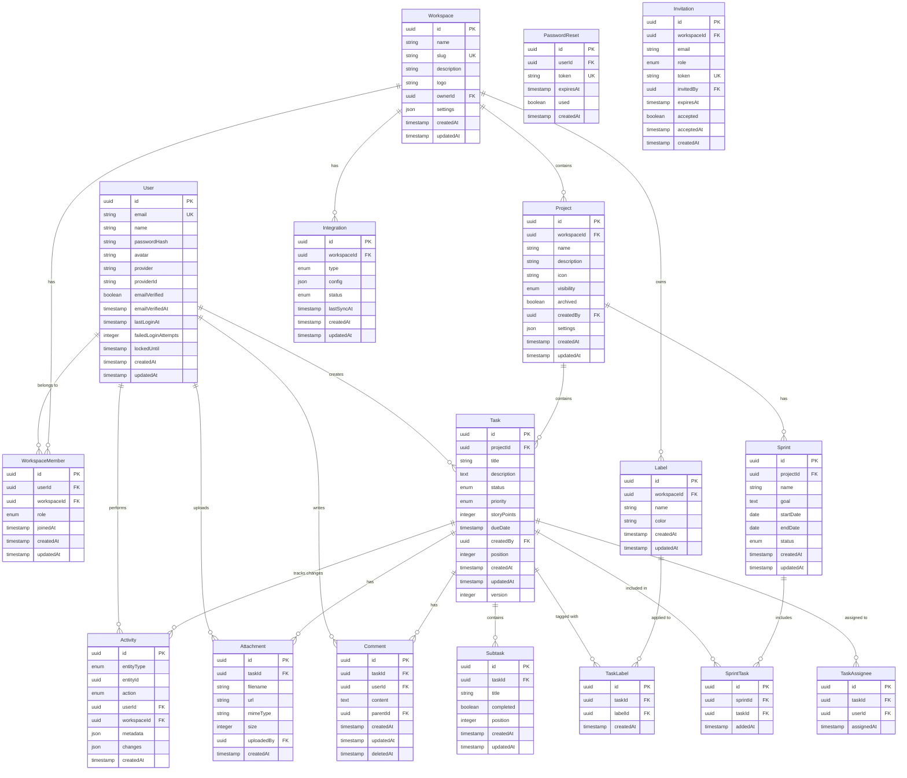

# TeamFlow Data Models

## 1. Entity Relationship Diagram (ERD)



## 2. Detailed Schema Definitions

### 2.1 User

Stores user account information and authentication data.

```typescript
interface User {
  id: string;                    // UUID primary key
  email: string;                 // Unique, indexed
  name: string;
  passwordHash: string | null;   // Null for OAuth users
  avatar: string | null;         // URL to avatar image
  provider: 'email' | 'google';  // Auth provider
  providerId: string | null;     // OAuth provider ID
  emailVerified: boolean;
  emailVerifiedAt: Date | null;
  lastLoginAt: Date | null;
  failedLoginAttempts: number;   // Default: 0
  lockedUntil: Date | null;      // Account lock timestamp
  createdAt: Date;
  updatedAt: Date;
}
```

**Constraints**:
- `email`: UNIQUE, NOT NULL, valid email format
- `name`: NOT NULL, 2-100 characters
- `passwordHash`: Required if provider = 'email'
- `failedLoginAttempts`: DEFAULT 0, locked after 5 attempts
- `lockedUntil`: Auto-set to 15 minutes from lock time

**Indexes**:
- PRIMARY KEY: `id`
- UNIQUE INDEX: `email`
- INDEX: `provider, providerId` (for OAuth lookups)

**Validations**:
- Email format validation
- Password: min 8 chars, 1 uppercase, 1 lowercase, 1 number
- Name: 2-100 characters

---

### 2.2 Workspace

Represents a team workspace containing projects and members.

```typescript
interface Workspace {
  id: string;                    // UUID primary key
  name: string;
  slug: string;                  // Unique URL-friendly identifier
  description: string | null;
  logo: string | null;           // URL to logo image
  ownerId: string;               // FK to User
  settings: WorkspaceSettings;   // JSON configuration
  createdAt: Date;
  updatedAt: Date;
}

interface WorkspaceSettings {
  defaultRole: 'member' | 'viewer';
  allowMemberInvites: boolean;
  requireEmailVerification: boolean;
  timezone: string;              // IANA timezone
}
```

**Constraints**:
- `name`: NOT NULL, 3-50 characters
- `slug`: UNIQUE, NOT NULL, lowercase, alphanumeric + hyphens
- `ownerId`: FK to User(id) ON DELETE RESTRICT

**Indexes**:
- PRIMARY KEY: `id`
- UNIQUE INDEX: `slug`
- INDEX: `ownerId`

**Validations**:
- Slug auto-generated from name, must be unique
- Name: 3-50 characters

---

### 2.3 WorkspaceMember

Junction table linking users to workspaces with roles.

```typescript
enum WorkspaceRole {
  OWNER = 'owner',
  ADMIN = 'admin',
  MEMBER = 'member',
  VIEWER = 'viewer'
}

interface WorkspaceMember {
  id: string;                    // UUID primary key
  userId: string;                // FK to User
  workspaceId: string;           // FK to Workspace
  role: WorkspaceRole;
  joinedAt: Date;
  createdAt: Date;
  updatedAt: Date;
}
```

**Constraints**:
- `userId`: FK to User(id) ON DELETE CASCADE
- `workspaceId`: FK to Workspace(id) ON DELETE CASCADE
- UNIQUE: `(userId, workspaceId)` - one membership per user per workspace

**Indexes**:
- PRIMARY KEY: `id`
- UNIQUE INDEX: `(userId, workspaceId)`
- INDEX: `workspaceId, role` (for permission checks)

**Validations**:
- Only one OWNER per workspace
- Cannot remove last OWNER

---

### 2.4 Project

Represents a project within a workspace.

```typescript
enum ProjectVisibility {
  PUBLIC = 'public',      // All workspace members
  PRIVATE = 'private'     // Invited members only
}

interface Project {
  id: string;                    // UUID primary key
  workspaceId: string;           // FK to Workspace
  name: string;
  description: string | null;
  icon: string | null;           // Emoji or icon identifier
  visibility: ProjectVisibility;
  archived: boolean;
  createdBy: string;             // FK to User
  settings: ProjectSettings;     // JSON configuration
  createdAt: Date;
  updatedAt: Date;
}

interface ProjectSettings {
  template: 'kanban' | 'scrum' | 'bug_tracking';
  enableSprints: boolean;
  enableStoryPoints: boolean;
  defaultAssignee: string | null;  // User ID
  taskStatuses: string[];          // Custom status names
}
```

**Constraints**:
- `name`: NOT NULL, 3-100 characters
- `workspaceId`: FK to Workspace(id) ON DELETE CASCADE
- `createdBy`: FK to User(id) ON DELETE SET NULL
- `archived`: DEFAULT false

**Indexes**:
- PRIMARY KEY: `id`
- INDEX: `workspaceId, archived` (for listing active projects)
- INDEX: `createdBy`

**Validations**:
- Name: 3-100 characters
- Visibility defaults to PUBLIC

---

### 2.5 Task

Core entity representing a work item.

```typescript
enum TaskStatus {
  TODO = 'todo',
  IN_PROGRESS = 'in_progress',
  DONE = 'done',
  BLOCKED = 'blocked',
  CANCELLED = 'cancelled'
}

enum TaskPriority {
  LOW = 'low',
  MEDIUM = 'medium',
  HIGH = 'high',
  CRITICAL = 'critical'
}

interface Task {
  id: string;                    // UUID primary key
  projectId: string;             // FK to Project
  title: string;
  description: string | null;    // Markdown content
  status: TaskStatus;
  priority: TaskPriority;
  storyPoints: number | null;    // 1, 2, 3, 5, 8, 13, 21
  dueDate: Date | null;
  createdBy: string;             // FK to User
  position: number;              // For ordering within status column
  createdAt: Date;
  updatedAt: Date;
  version: number;               // Optimistic locking
}
```

**Constraints**:
- `title`: NOT NULL, 3-200 characters
- `projectId`: FK to Project(id) ON DELETE CASCADE
- `createdBy`: FK to User(id) ON DELETE SET NULL
- `status`: DEFAULT 'todo'
- `priority`: DEFAULT 'medium'
- `storyPoints`: NULL or (1, 2, 3, 5, 8, 13, 21)
- `position`: NOT NULL, for drag-drop ordering
- `version`: DEFAULT 1, incremented on each update

**Indexes**:
- PRIMARY KEY: `id`
- INDEX: `projectId, status, position` (for board views)
- INDEX: `createdBy`
- INDEX: `dueDate` (for deadline queries)
- INDEX: `updatedAt` (for recent activity)

**Validations**:
- Title: 3-200 characters
- Story points must be Fibonacci numbers

---

### 2.6 TaskAssignee

Many-to-many relationship between tasks and users.

```typescript
interface TaskAssignee {
  id: string;                    // UUID primary key
  taskId: string;                // FK to Task
  userId: string;                // FK to User
  assignedAt: Date;
}
```

**Constraints**:
- `taskId`: FK to Task(id) ON DELETE CASCADE
- `userId`: FK to User(id) ON DELETE CASCADE
- UNIQUE: `(taskId, userId)` - prevent duplicate assignments

**Indexes**:
- PRIMARY KEY: `id`
- UNIQUE INDEX: `(taskId, userId)`
- INDEX: `userId` (for "my tasks" queries)

---

### 2.7 Sprint

Represents a time-boxed iteration for Scrum projects.

```typescript
enum SprintStatus {
  PLANNED = 'planned',
  ACTIVE = 'active',
  COMPLETED = 'completed',
  CANCELLED = 'cancelled'
}

interface Sprint {
  id: string;                    // UUID primary key
  projectId: string;             // FK to Project
  name: string;                  // e.g., "Sprint 1", "Q4 2024"
  goal: string | null;           // Sprint objective
  startDate: Date;
  endDate: Date;
  status: SprintStatus;
  createdAt: Date;
  updatedAt: Date;
}
```

**Constraints**:
- `name`: NOT NULL, 3-100 characters
- `projectId`: FK to Project(id) ON DELETE CASCADE
- `startDate`: NOT NULL, must be < endDate
- `endDate`: NOT NULL
- `status`: DEFAULT 'planned'

**Indexes**:
- PRIMARY KEY: `id`
- INDEX: `projectId, status` (for active sprint queries)
- INDEX: `startDate, endDate` (for date range queries)

**Validations**:
- Only one ACTIVE sprint per project
- Start date must be before end date
- Sprint duration typically 1-4 weeks

---

### 2.8 SprintTask

Junction table linking tasks to sprints.

```typescript
interface SprintTask {
  id: string;                    // UUID primary key
  sprintId: string;              // FK to Sprint
  taskId: string;                // FK to Task
  addedAt: Date;
}
```

**Constraints**:
- `sprintId`: FK to Sprint(id) ON DELETE CASCADE
- `taskId`: FK to Task(id) ON DELETE CASCADE
- UNIQUE: `(sprintId, taskId)` - task can't be in sprint twice

**Indexes**:
- PRIMARY KEY: `id`
- UNIQUE INDEX: `(sprintId, taskId)`
- INDEX: `taskId` (for checking task sprint membership)

---

### 2.9 Comment

Comments and discussions on tasks.

```typescript
interface Comment {
  id: string;                    // UUID primary key
  taskId: string;                // FK to Task
  userId: string;                // FK to User
  content: string;               // Markdown content
  parentId: string | null;       // FK to Comment (for threading)
  createdAt: Date;
  updatedAt: Date;
  deletedAt: Date | null;        // Soft delete
}
```

**Constraints**:
- `content`: NOT NULL, 1-5000 characters
- `taskId`: FK to Task(id) ON DELETE CASCADE
- `userId`: FK to User(id) ON DELETE SET NULL
- `parentId`: FK to Comment(id) ON DELETE CASCADE

**Indexes**:
- PRIMARY KEY: `id`
- INDEX: `taskId, createdAt` (for chronological display)
- INDEX: `userId`
- INDEX: `parentId` (for threaded replies)

**Validations**:
- Content: 1-5000 characters
- Soft delete preserves comment history

---

### 2.10 Label

Color-coded tags for organizing tasks.

```typescript
interface Label {
  id: string;                    // UUID primary key
  workspaceId: string;           // FK to Workspace
  name: string;
  color: string;                 // Hex color code
  createdAt: Date;
  updatedAt: Date;
}
```

**Constraints**:
- `name`: NOT NULL, 1-50 characters
- `workspaceId`: FK to Workspace(id) ON DELETE CASCADE
- `color`: NOT NULL, hex format (#RRGGBB)
- UNIQUE: `(workspaceId, name)` - unique label names per workspace

**Indexes**:
- PRIMARY KEY: `id`
- UNIQUE INDEX: `(workspaceId, name)`
- INDEX: `workspaceId`

**Validations**:
- Name: 1-50 characters
- Color: valid hex code

---

### 2.11 TaskLabel

Many-to-many relationship between tasks and labels.

```typescript
interface TaskLabel {
  id: string;                    // UUID primary key
  taskId: string;                // FK to Task
  labelId: string;               // FK to Label
  createdAt: Date;
}
```

**Constraints**:
- `taskId`: FK to Task(id) ON DELETE CASCADE
- `labelId`: FK to Label(id) ON DELETE CASCADE
- UNIQUE: `(taskId, labelId)` - prevent duplicate labels

**Indexes**:
- PRIMARY KEY: `id`
- UNIQUE INDEX: `(taskId, labelId)`
- INDEX: `labelId` (for finding all tasks with a label)

---

### 2.12 Subtask

Checklist items within a task.

```typescript
interface Subtask {
  id: string;                    // UUID primary key
  taskId: string;                // FK to Task
  title: string;
  completed: boolean;
  position: number;              // For ordering
  createdAt: Date;
  updatedAt: Date;
}
```

**Constraints**:
- `title`: NOT NULL, 1-200 characters
- `taskId`: FK to Task(id) ON DELETE CASCADE
- `completed`: DEFAULT false
- `position`: NOT NULL

**Indexes**:
- PRIMARY KEY: `id`
- INDEX: `taskId, position` (for ordered display)

**Validations**:
- Title: 1-200 characters

---

### 2.13 Attachment

File attachments on tasks.

```typescript
interface Attachment {
  id: string;                    // UUID primary key
  taskId: string;                // FK to Task
  filename: string;              // Original filename
  url: string;                   // Storage URL (S3, etc.)
  mimeType: string;              // File MIME type
  size: number;                  // File size in bytes
  uploadedBy: string;            // FK to User
  createdAt: Date;
}
```

**Constraints**:
- `filename`: NOT NULL
- `url`: NOT NULL
- `taskId`: FK to Task(id) ON DELETE CASCADE
- `uploadedBy`: FK to User(id) ON DELETE SET NULL
- `size`: Max 10MB per file, 50MB per task total

**Indexes**:
- PRIMARY KEY: `id`
- INDEX: `taskId` (for listing task attachments)
- INDEX: `uploadedBy`

**Validations**:
- Max 10MB per file
- Max 50MB total attachments per task
- Allowed MIME types: images, PDFs, documents

---

### 2.14 Activity

Audit log tracking all changes across entities.

```typescript
enum EntityType {
  TASK = 'task',
  PROJECT = 'project',
  WORKSPACE = 'workspace',
  COMMENT = 'comment',
  SPRINT = 'sprint'
}

enum ActivityAction {
  CREATED = 'created',
  UPDATED = 'updated',
  DELETED = 'deleted',
  ASSIGNED = 'assigned',
  COMMENTED = 'commented',
  STATUS_CHANGED = 'status_changed',
  MOVED = 'moved'
}

interface Activity {
  id: string;                    // UUID primary key
  entityType: EntityType;
  entityId: string;              // Generic FK to any entity
  action: ActivityAction;
  userId: string;                // FK to User who performed action
  workspaceId: string;           // FK to Workspace (for filtering)
  metadata: Record<string, any>; // Action-specific data
  changes: {                     // Before/after values
    field: string;
    oldValue: any;
    newValue: any;
  }[];
  createdAt: Date;
}
```

**Constraints**:
- `entityId`: NOT NULL (polymorphic FK)
- `userId`: FK to User(id) ON DELETE SET NULL
- `workspaceId`: FK to Workspace(id) ON DELETE CASCADE

**Indexes**:
- PRIMARY KEY: `id`
- INDEX: `entityType, entityId, createdAt` (for entity history)
- INDEX: `workspaceId, createdAt` (for activity feeds)
- INDEX: `userId, createdAt` (for user activity)

**Data Retention**:
- Keep activity logs for 90 days
- Archive older logs to cold storage

---

### 2.15 Integration

Third-party integrations (Slack, GitHub, etc.).

```typescript
enum IntegrationType {
  SLACK = 'slack',
  GITHUB = 'github',
  JIRA = 'jira',
  WEBHOOK = 'webhook'
}

enum IntegrationStatus {
  ACTIVE = 'active',
  INACTIVE = 'inactive',
  ERROR = 'error'
}

interface Integration {
  id: string;                    // UUID primary key
  workspaceId: string;           // FK to Workspace
  type: IntegrationType;
  config: IntegrationConfig;     // JSON configuration
  status: IntegrationStatus;
  lastSyncAt: Date | null;
  createdAt: Date;
  updatedAt: Date;
}

interface IntegrationConfig {
  webhookUrl?: string;
  apiKey?: string;              // Encrypted
  channels?: string[];          // For Slack
  repositories?: string[];      // For GitHub
  syncInterval?: number;        // Minutes
}
```

**Constraints**:
- `workspaceId`: FK to Workspace(id) ON DELETE CASCADE
- `status`: DEFAULT 'inactive'

**Indexes**:
- PRIMARY KEY: `id`
- INDEX: `workspaceId, type` (for listing integrations)
- INDEX: `status` (for sync jobs)

**Security**:
- Encrypt sensitive config fields (API keys, tokens)
- Validate webhook signatures

---

### 2.16 PasswordReset

Temporary tokens for password reset flow.

```typescript
interface PasswordReset {
  id: string;                    // UUID primary key
  userId: string;                // FK to User
  token: string;                 // Unique, hashed token
  expiresAt: Date;               // 1 hour from creation
  used: boolean;
  createdAt: Date;
}
```

**Constraints**:
- `userId`: FK to User(id) ON DELETE CASCADE
- `token`: UNIQUE, hashed with bcrypt
- `expiresAt`: NOT NULL
- `used`: DEFAULT false

**Indexes**:
- PRIMARY KEY: `id`
- UNIQUE INDEX: `token`
- INDEX: `userId, used` (for validating reset requests)

**Security**:
- Token expires after 1 hour
- Single-use only (marked as used)
- Auto-cleanup expired tokens

---

### 2.17 Invitation

Pending workspace invitations.

```typescript
interface Invitation {
  id: string;                    // UUID primary key
  workspaceId: string;           // FK to Workspace
  email: string;
  role: WorkspaceRole;
  token: string;                 // Unique invitation token
  invitedBy: string;             // FK to User
  expiresAt: Date;               // 7 days from creation
  accepted: boolean;
  acceptedAt: Date | null;
  createdAt: Date;
}
```

**Constraints**:
- `email`: NOT NULL
- `workspaceId`: FK to Workspace(id) ON DELETE CASCADE
- `invitedBy`: FK to User(id) ON DELETE SET NULL
- `token`: UNIQUE
- `expiresAt`: NOT NULL (7 days)
- `accepted`: DEFAULT false

**Indexes**:
- PRIMARY KEY: `id`
- UNIQUE INDEX: `token`
- INDEX: `workspaceId, accepted` (for pending invitations)
- INDEX: `email` (for checking existing invitations)

**Validations**:
- Cannot invite existing workspace member
- Invitation expires after 7 days

---

## 3. Relationships Summary

### One-to-Many Relationships

- User → WorkspaceMember (1:N)
- User → Task (creator) (1:N)
- User → Comment (1:N)
- User → Activity (1:N)
- Workspace → WorkspaceMember (1:N)
- Workspace → Project (1:N)
- Workspace → Label (1:N)
- Workspace → Integration (1:N)
- Project → Task (1:N)
- Project → Sprint (1:N)
- Task → Comment (1:N)
- Task → Attachment (1:N)
- Task → Subtask (1:N)
- Sprint → SprintTask (1:N)
- Comment → Comment (parent) (1:N)

### Many-to-Many Relationships

- Task ←→ User (via TaskAssignee) - Multiple assignees per task
- Task ←→ Label (via TaskLabel) - Multiple labels per task
- Task ←→ Sprint (via SprintTask) - Tasks can move between sprints

---

## 4. Performance Indexes

### Critical Indexes for Query Performance

```sql
-- User lookups
CREATE INDEX idx_user_email ON User(email);
CREATE INDEX idx_user_provider ON User(provider, providerId);

-- Workspace queries
CREATE INDEX idx_workspace_slug ON Workspace(slug);
CREATE INDEX idx_workspace_owner ON Workspace(ownerId);

-- Workspace member access checks
CREATE UNIQUE INDEX idx_workspace_member ON WorkspaceMember(userId, workspaceId);
CREATE INDEX idx_workspace_member_role ON WorkspaceMember(workspaceId, role);

-- Project listing
CREATE INDEX idx_project_workspace ON Project(workspaceId, archived);

-- Task board views (most critical)
CREATE INDEX idx_task_board ON Task(projectId, status, position);
CREATE INDEX idx_task_assignee ON TaskAssignee(userId);
CREATE INDEX idx_task_due_date ON Task(dueDate) WHERE dueDate IS NOT NULL;
CREATE INDEX idx_task_updated ON Task(updatedAt DESC);

-- Activity feed
CREATE INDEX idx_activity_workspace ON Activity(workspaceId, createdAt DESC);
CREATE INDEX idx_activity_entity ON Activity(entityType, entityId, createdAt DESC);

-- Sprint queries
CREATE INDEX idx_sprint_project ON Sprint(projectId, status);
CREATE INDEX idx_sprint_dates ON Sprint(startDate, endDate);

-- Comments
CREATE INDEX idx_comment_task ON Comment(taskId, createdAt);

-- Labels
CREATE UNIQUE INDEX idx_label_name ON Label(workspaceId, name);
```

---

## 5. Database Constraints & Rules

### Business Logic Constraints

1. **Workspace Ownership**:
   - Every workspace must have exactly one OWNER
   - Owner cannot be removed from workspace
   - Workspace must have at least one member

2. **Project Access**:
   - Private projects require explicit member invitation
   - Public projects accessible to all workspace members

3. **Task Assignment**:
   - Can only assign tasks to workspace members
   - Multiple assignees allowed per task

4. **Sprint Management**:
   - Only one ACTIVE sprint per project at a time
   - Sprint dates cannot overlap within same project
   - Tasks can be moved between sprints

5. **File Attachments**:
   - Max 10MB per file
   - Max 50MB total per task
   - Allowed types: images, PDFs, documents

6. **Optimistic Locking**:
   - Task.version field for concurrent edit detection
   - Increment version on each update
   - Reject updates with stale version numbers

---

## 6. Enums Reference

### TaskStatus
```typescript
enum TaskStatus {
  TODO = 'todo',
  IN_PROGRESS = 'in_progress',
  DONE = 'done',
  BLOCKED = 'blocked',
  CANCELLED = 'cancelled'
}
```

### TaskPriority
```typescript
enum TaskPriority {
  LOW = 'low',
  MEDIUM = 'medium',
  HIGH = 'high',
  CRITICAL = 'critical'
}
```

### WorkspaceRole
```typescript
enum WorkspaceRole {
  OWNER = 'owner',
  ADMIN = 'admin',
  MEMBER = 'member',
  VIEWER = 'viewer'
}
```

### SprintStatus
```typescript
enum SprintStatus {
  PLANNED = 'planned',
  ACTIVE = 'active',
  COMPLETED = 'completed',
  CANCELLED = 'cancelled'
}
```

### ProjectVisibility
```typescript
enum ProjectVisibility {
  PUBLIC = 'public',
  PRIVATE = 'private'
}
```

### IntegrationType
```typescript
enum IntegrationType {
  SLACK = 'slack',
  GITHUB = 'github',
  JIRA = 'jira',
  WEBHOOK = 'webhook'
}
```

### IntegrationStatus
```typescript
enum IntegrationStatus {
  ACTIVE = 'active',
  INACTIVE = 'inactive',
  ERROR = 'error'
}
```

### EntityType
```typescript
enum EntityType {
  TASK = 'task',
  PROJECT = 'project',
  WORKSPACE = 'workspace',
  COMMENT = 'comment',
  SPRINT = 'sprint'
}
```

### ActivityAction
```typescript
enum ActivityAction {
  CREATED = 'created',
  UPDATED = 'updated',
  DELETED = 'deleted',
  ASSIGNED = 'assigned',
  COMMENTED = 'commented',
  STATUS_CHANGED = 'status_changed',
  MOVED = 'moved'
}
```

---

## 7. Data Validation Rules

### User Validation
- Email: Valid format, max 255 chars
- Name: 2-100 characters
- Password: Min 8 chars, 1 uppercase, 1 lowercase, 1 number

### Workspace Validation
- Name: 3-50 characters
- Slug: Lowercase, alphanumeric + hyphens only
- Description: Max 500 characters

### Project Validation
- Name: 3-100 characters
- Description: Max 2000 characters

### Task Validation
- Title: 3-200 characters
- Description: Max 50,000 characters (markdown)
- Story Points: Must be Fibonacci (1, 2, 3, 5, 8, 13, 21) or null
- Position: Non-negative integer for ordering

### Comment Validation
- Content: 1-5000 characters

### Label Validation
- Name: 1-50 characters
- Color: Valid hex code (#RRGGBB)

### Attachment Validation
- File size: Max 10MB per file
- Total size: Max 50MB per task
- MIME types: Whitelist of allowed types

---

## 8. Soft Deletes & Cascades

### Soft Delete Entities
- Comment (deletedAt field)

### Cascade Delete Rules
- Delete Workspace → Cascade delete Projects, Members, Labels, Integrations
- Delete Project → Cascade delete Tasks, Sprints
- Delete Task → Cascade delete Comments, Attachments, Subtasks, Assignments
- Delete User → Set NULL for createdBy fields, CASCADE for memberships

---

## 9. Database Technology Recommendations

### Recommended Stack
- **Primary Database**: PostgreSQL 15+
  - Native UUID support
  - JSONB for flexible settings/metadata
  - Full-text search capabilities
  - Strong ACID guarantees

- **Caching Layer**: Redis
  - Session storage
  - Real-time presence data
  - Rate limiting counters

- **File Storage**: AWS S3 / Cloudflare R2
  - Attachment storage
  - Avatar/logo images

- **Search Engine**: PostgreSQL Full-Text Search (MVP) → Elasticsearch (Scale)
  - Task/comment search
  - Fuzzy matching

---

## 10. Migration Strategy

### Phase 1: Core Tables (Sprint 1)
- User, PasswordReset, Invitation
- Workspace, WorkspaceMember
- Project

### Phase 2: Task System (Sprint 2-3)
- Task, TaskAssignee, TaskLabel
- Label, Subtask
- Comment

### Phase 3: Sprint & Advanced (Sprint 4-5)
- Sprint, SprintTask
- Attachment
- Activity
- Integration

### Phase 4: Optimizations (Sprint 6+)
- Add computed columns
- Optimize indexes based on query patterns
- Implement partitioning for Activity table
- Add materialized views for analytics

---

**Document Version**: 1.0
**Last Updated**: 2025-09-30
**Status**: Ready for Implementation