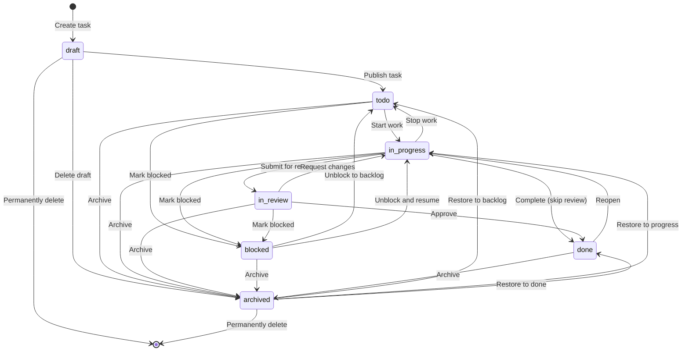
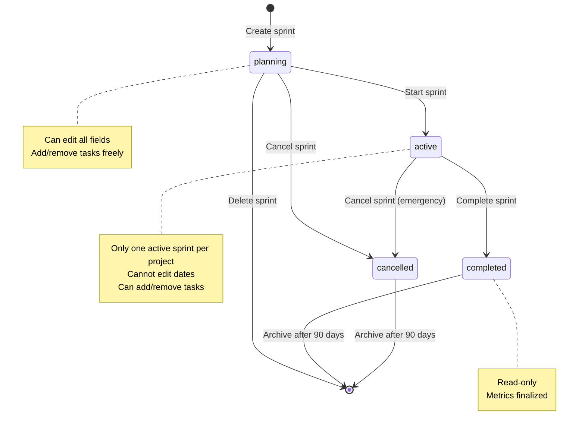
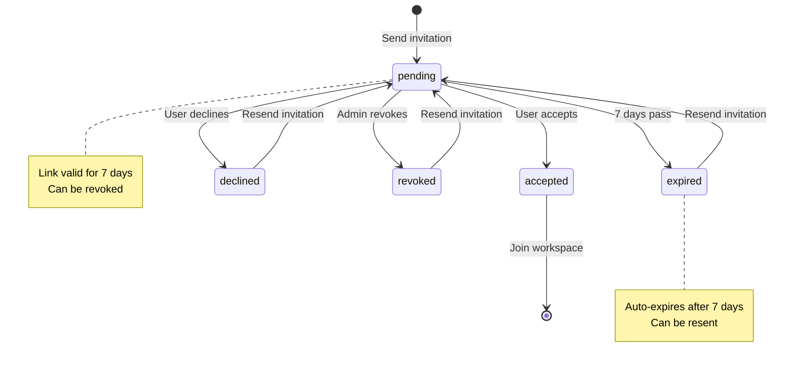
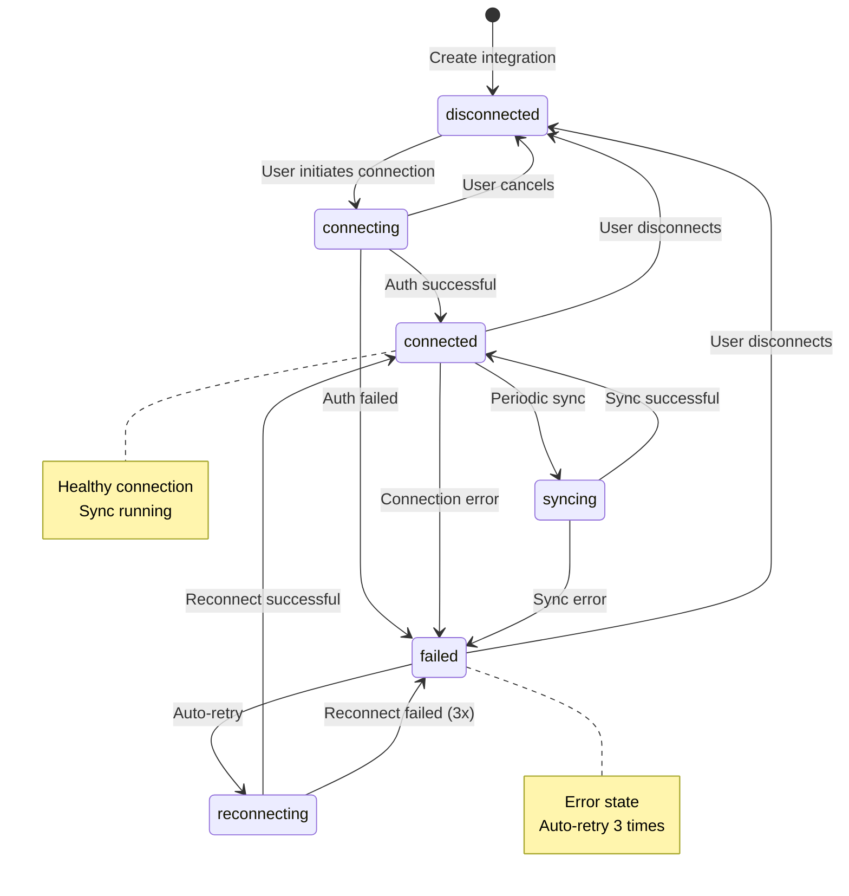
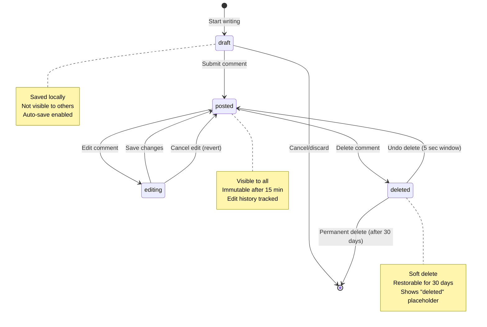
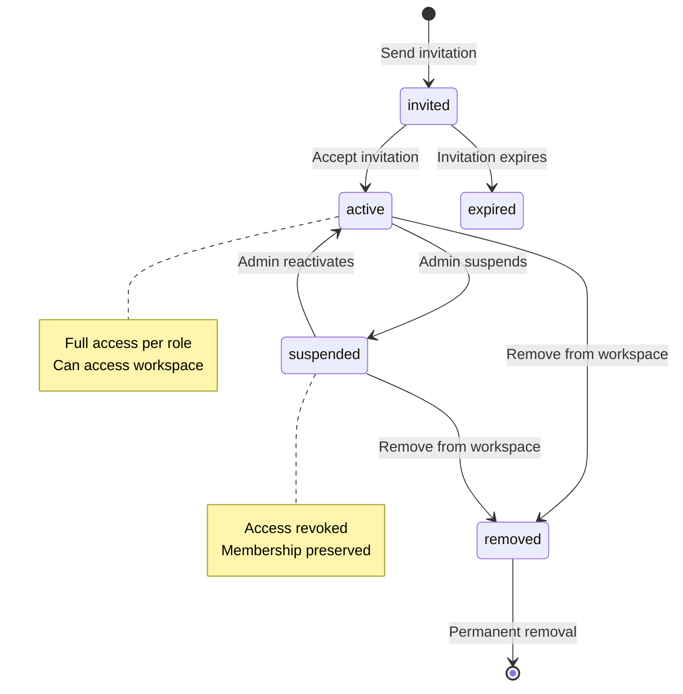
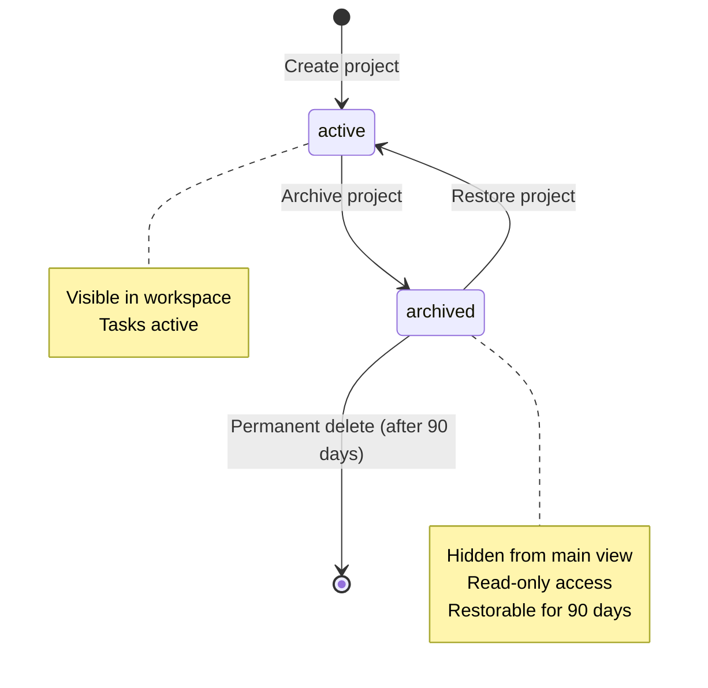

# TeamFlow State Machines

This document defines the state machines for key entities in TeamFlow, including all valid states, transitions, permissions, and side effects.

## Table of Contents
1. [Task State Machine](#1-task-state-machine)
2. [Sprint State Machine](#2-sprint-state-machine)
3. [User Invitation State Machine](#3-user-invitation-state-machine)
4. [Integration Connection State Machine](#4-integration-connection-state-machine)
5. [Comment State Machine](#5-comment-state-machine)
6. [Workspace Member State Machine](#6-workspace-member-state-machine)
7. [Project State Machine](#7-project-state-machine)

---

## 1. Task State Machine

### 1.1 State Diagram

### 1.2 States Description

| State | Description | UI Indicator |
|-------|-------------|--------------|
| **draft** | Task is being created, not visible to team | Gray, italic |
| **todo** | Task is ready to work on, in backlog | Blue |
| **in_progress** | Task is actively being worked on | Yellow/Orange |
| **in_review** | Task is complete, awaiting approval | Purple |
| **blocked** | Task cannot proceed, waiting on dependency | Red |
| **done** | Task is completed and approved | Green |
| **archived** | Task is archived, not deleted | Gray, dimmed |

### 1.3 Transition Rules

#### draft → todo (Publish Task)
**Who can trigger**: Creator, Owner, Admin, Member

**Preconditions**:
- Task title is not empty (3-200 chars)
- Task is assigned to at least one user (optional, configurable)

**Side effects**:
- Set status = 'todo'
- Set position at top of todo column
- Broadcast TASK_PUBLISHED event
- Notify assignees if assigned
- Create activity log: "published task"

**Business rules**:
- Cannot publish if title validation fails
- Task becomes visible to all project members

---

#### todo → in_progress (Start Work)
**Who can trigger**: Assignee, Owner, Admin

**Preconditions**:
- User must be assigned to task OR have Owner/Admin role
- Task not blocked by dependencies (optional check)

**Side effects**:
- Set status = 'in_progress'
- Set startedAt timestamp
- Auto-assign user if not already assigned
- Move to "In Progress" column
- Broadcast TASK_STARTED event
- Notify other assignees
- Create activity log: "started working on task"
- Update sprint burndown chart if in active sprint

**Business rules**:
- Viewer role cannot start tasks
- If WIP limit enabled, check column limit

---

#### in_progress → in_review (Submit for Review)
**Who can trigger**: Assignee, Owner, Admin

**Preconditions**:
- Task has description or attachments (evidence of work)
- Subtasks are completed (if any exist)

**Side effects**:
- Set status = 'in_review'
- Move to "In Review" column
- Broadcast TASK_SUBMITTED event
- Notify project admins/reviewers
- Notify other assignees
- Create activity log: "submitted for review"
- Start review timer (SLA tracking)

**Business rules**:
- Cannot submit empty task for review
- Must complete all subtasks first (configurable)

---

#### in_review → done (Approve)
**Who can trigger**: Owner, Admin, Designated Reviewer

**Preconditions**:
- User has review permissions
- No pending change requests

**Side effects**:
- Set status = 'done'
- Set completedAt timestamp
- Move to "Done" column
- Broadcast TASK_COMPLETED event
- Notify all assignees
- Show celebration animation
- Update sprint velocity
- Create activity log: "approved and completed task"
- Calculate task cycle time
- Update project completion percentage

**Business rules**:
- Regular members cannot approve (unless they're designated reviewers)
- Task cannot be edited once approved (must reopen first)

---

#### in_review → in_progress (Request Changes)
**Who can trigger**: Owner, Admin, Designated Reviewer

**Preconditions**:
- User has review permissions
- Must provide comment explaining changes needed

**Side effects**:
- Set status = 'in_progress'
- Move back to "In Progress" column
- Increment reviewCyclesCount
- Broadcast TASK_CHANGES_REQUESTED event
- Notify assignees with change requests
- Create activity log: "requested changes"
- Reset review timer

**Business rules**:
- Must include comment with specific change requests
- Tracks number of review cycles for metrics

---

#### in_progress → done (Complete - Skip Review)
**Who can trigger**: Owner, Admin (configurable)

**Preconditions**:
- Project settings allow skipping review
- OR task priority is Low
- OR user has skip-review permission

**Side effects**:
- Same as in_review → done
- Log that review was skipped

**Business rules**:
- Not allowed for High/Critical priority tasks (configurable)
- Tracks skip rate for auditing

---

#### * → blocked (Mark Blocked)
**Who can trigger**: Assignee, Owner, Admin

**Preconditions**:
- Must provide blocker reason
- Must tag blocking task/issue (optional)

**Side effects**:
- Set status = 'blocked'
- Set blockedAt timestamp
- Set blockerReason in metadata
- Move to "Blocked" column
- Broadcast TASK_BLOCKED event
- Notify task creator and project admins
- Create high-priority notification
- Create activity log: "blocked task - [reason]"
- Update sprint risk metrics
- Start blocker SLA timer

**Business rules**:
- Blocker reason is required (1-500 chars)
- Cannot be blocked if already done
- Tracks blocker duration for metrics

---

#### blocked → * (Unblock)
**Who can trigger**: Assignee, Owner, Admin, Blocker resolver

**Preconditions**:
- Blocker issue is resolved
- Must provide resolution note

**Side effects**:
- Set status to target state (todo or in_progress)
- Clear blockedAt timestamp
- Set unblockedAt timestamp
- Calculate blocker duration
- Move to appropriate column
- Broadcast TASK_UNBLOCKED event
- Notify assignees
- Create activity log: "unblocked task - [resolution]"
- Update sprint risk metrics

**Business rules**:
- Resolution note required
- Tracks blocker resolution time

---

#### done → in_progress (Reopen)
**Who can trigger**: Owner, Admin

**Preconditions**:
- Must provide reason for reopening
- Sprint must be active (if task in sprint)

**Side effects**:
- Set status = 'in_progress'
- Clear completedAt timestamp
- Set reopenedAt timestamp
- Increment reopenCount
- Move back to "In Progress"
- Broadcast TASK_REOPENED event
- Notify assignees
- Create activity log: "reopened task - [reason]"
- Adjust sprint velocity (subtract points)
- Update project completion percentage

**Business rules**:
- Cannot reopen if sprint is completed
- Reason required for audit trail
- Tracks reopen rate for quality metrics

---

#### * → archived (Archive)
**Who can trigger**: Creator, Owner, Admin

**Preconditions**:
- Confirm archive action
- Cannot archive if in active sprint (must remove first)

**Side effects**:
- Set status = 'archived'
- Set archivedAt timestamp
- Set archivedBy userId
- Remove from board view (soft delete)
- Keep in database
- Broadcast TASK_ARCHIVED event
- Create activity log: "archived task"
- Remove from sprint if present
- Hide from default queries

**Business rules**:
- Cannot archive tasks in active sprint without removing first
- Archived tasks don't count toward metrics
- Can be restored within 30 days

---

#### archived → * (Restore)
**Who can trigger**: Owner, Admin, Original archiver

**Preconditions**:
- Task archived < 30 days ago
- Project still exists and not archived

**Side effects**:
- Set status to target state
- Clear archivedAt timestamp
- Restore to board view
- Broadcast TASK_RESTORED event
- Notify original assignees
- Create activity log: "restored task to [state]"

**Business rules**:
- Cannot restore to in_review or blocked directly
- Restores to todo or in_progress only
- After 30 days, requires admin approval

---

### 1.4 Invalid Transitions

The following transitions are **NOT** allowed:

- draft → in_review (must go through todo/in_progress)
- draft → done (must go through workflow)
- todo → done (must be worked on first, unless skip-review)
- blocked → done (must be unblocked first)
- archived → blocked (restore first, then block)
- done → blocked (reopen first, then block)

### 1.5 Automatic Transitions

#### Auto-archive inactive tasks
- **Trigger**: Task in 'todo' status for > 90 days with no activity
- **Condition**: Project setting 'auto_archive_inactive' = true
- **Action**: Transition to archived
- **Notification**: Notify creator 7 days before auto-archive

#### Auto-unblock on dependency completion
- **Trigger**: Blocking task transitions to 'done'
- **Condition**: blockedBy relationship exists
- **Action**: Transition blocked → todo or in_progress
- **Notification**: Notify assignees that blocker resolved

---

## 2. Sprint State Machine

### 2.1 State Diagram

### 2.2 States Description

| State | Description | Editable |
|-------|-------------|----------|
| **planning** | Sprint created, not yet started | Yes - all fields |
| **active** | Sprint in progress, team working | Partial - no dates |
| **completed** | Sprint finished, metrics calculated | No - read-only |
| **cancelled** | Sprint cancelled before/during execution | No - read-only |

### 2.3 Transition Rules

#### [*] → planning (Create Sprint)
**Who can trigger**: Owner, Admin

**Preconditions**:
- User has project admin permissions
- Sprint name provided

**Side effects**:
- Create Sprint record with status = 'planning'
- Generate default name if not provided (Sprint {n})
- Set default dates (start: today, end: +14 days)
- Broadcast SPRINT_CREATED event
- Create activity log: "created sprint"

**Business rules**:
- No limit on planning sprints
- Can have multiple planning sprints simultaneously

---

#### planning → active (Start Sprint)
**Who can trigger**: Owner, Admin

**Preconditions**:
- Sprint has at least one task (recommended, not required)
- No other sprint is active in same project
- Start date is today or in past
- End date is in future

**Side effects**:
- Set status = 'active'
- Set actualStartDate = now
- Lock sprint dates (cannot edit)
- Initialize burndown chart data
- Calculate initial velocity
- Broadcast SPRINT_STARTED event
- Notify all team members
- Create activity log: "started sprint"
- Auto-transition tasks: update sprint context

**Business rules**:
- Only ONE active sprint per project
- Must end any active sprint before starting new one
- Start date cannot be in future (auto-starts if today)
- Cannot start if another sprint is active

---

#### active → completed (Complete Sprint)
**Who can trigger**: Owner, Admin

**Preconditions**:
- Sprint is currently active
- End date reached OR manual completion
- User confirms completion

**Side effects**:
- Set status = 'completed'
- Set actualEndDate = now
- Calculate final metrics:
  - Actual velocity (completed story points)
  - Completion rate (% tasks done)
  - Average cycle time
  - Burndown accuracy
- Handle incomplete tasks per user selection:
  - Move to backlog
  - Move to next sprint
  - Keep in completed sprint
- Finalize sprint report
- Broadcast SPRINT_COMPLETED event
- Notify all team members
- Create activity log: "completed sprint"
- Generate retrospective template
- Archive sprint data
- Update project velocity baseline

**Business rules**:
- Cannot edit sprint after completion
- Incomplete tasks must be handled
- Metrics are finalized and immutable
- Report generated automatically

---

#### * → cancelled (Cancel Sprint)
**Who can trigger**: Owner, Admin

**Preconditions**:
- Must provide cancellation reason
- User confirms cancellation
- If active: must handle incomplete tasks

**Side effects**:
- Set status = 'cancelled'
- Set cancelledAt = now
- Set cancelledBy = userId
- Set cancellationReason in metadata
- Remove all tasks from sprint (move to backlog)
- Do NOT calculate velocity metrics
- Broadcast SPRINT_CANCELLED event
- Notify all team members
- Create activity log: "cancelled sprint - [reason]"

**Business rules**:
- Cancellation reason required
- Cannot cancel completed sprint
- Tasks automatically moved to backlog
- Does not affect project velocity calculation
- Can only cancel from planning or active state

---

#### planning → [*] (Delete Sprint)
**Who can trigger**: Owner, Admin

**Preconditions**:
- Sprint has no tasks
- Sprint never started (status = planning)
- User confirms deletion

**Side effects**:
- Permanently delete Sprint record
- Broadcast SPRINT_DELETED event
- Create activity log: "deleted sprint"

**Business rules**:
- Can only delete empty planning sprints
- Cannot delete active, completed, or cancelled sprints
- Cannot delete sprints with tasks (must remove tasks first)

---

#### completed/cancelled → [*] (Archive)
**Who can trigger**: System (automatic)

**Preconditions**:
- Sprint in completed or cancelled state
- 90 days have passed since completion/cancellation

**Side effects**:
- Move to archived storage (cold storage)
- Remove from active database queries
- Keep for historical reporting

**Business rules**:
- Automatic after 90 days
- Can restore from archive if needed
- Metrics remain accessible

---

### 2.4 Invalid Transitions

The following transitions are **NOT** allowed:

- active → planning (cannot go back)
- completed → active (cannot restart)
- completed → planning (cannot replan)
- cancelled → active (cannot restart)
- cancelled → planning (cannot replan)
- completed → cancelled (already done)

### 2.5 Automatic Transitions

#### Auto-complete on end date
- **Trigger**: Sprint end date reached
- **Condition**: status = 'active' AND endDate <= today
- **Action**: Notify admins to complete sprint
- **Grace period**: 2 days, then auto-complete

#### Auto-start on start date
- **Trigger**: Sprint start date reached
- **Condition**: status = 'planning' AND startDate <= today AND no active sprint
- **Action**: Automatically transition to active
- **Notification**: Notify team sprint started

---

## 3. User Invitation State Machine

### 3.1 State Diagram

### 3.2 States Description

| State | Description | Action Available |
|-------|-------------|------------------|
| **pending** | Invitation sent, awaiting response | Accept, Decline, Revoke |
| **accepted** | User accepted invitation | None - joined workspace |
| **declined** | User declined invitation | Resend |
| **expired** | Invitation expired (7 days) | Resend |
| **revoked** | Admin cancelled invitation | Resend |

### 3.3 Transition Rules

#### [*] → pending (Send Invitation)
**Who can trigger**: Owner, Admin

**Preconditions**:
- User has invite permissions
- Email not already a workspace member
- Email format valid

**Side effects**:
- Create Invitation record with status = 'pending'
- Generate unique token
- Set expiresAt = now + 7 days
- Send invitation email with link
- Broadcast INVITATION_SENT event
- Create activity log: "invited [email]"

**Business rules**:
- Token unique and cryptographically secure
- Email must not be existing member
- Can resend if previous invitation expired/declined

---

#### pending → accepted (User Accepts)
**Who can trigger**: Invited user only

**Preconditions**:
- Token is valid
- Token not expired
- Email matches logged-in user (or user creates account)
- Invitation not revoked

**Side effects**:
- Set status = 'accepted'
- Set acceptedAt = now
- Create WorkspaceMember record
- Grant access to workspace
- Broadcast INVITATION_ACCEPTED event
- Notify inviter
- Notify workspace admins
- Create activity log: "user accepted invitation"
- Send welcome email to new member

**Business rules**:
- Email must match invitation email
- Creates workspace membership immediately
- Invitation cannot be reused

---

#### pending → declined (User Declines)
**Who can trigger**: Invited user only

**Preconditions**:
- Token is valid
- Token not expired

**Side effects**:
- Set status = 'declined'
- Set declinedAt = now
- Broadcast INVITATION_DECLINED event
- Notify inviter
- Create activity log: "user declined invitation"

**Business rules**:
- Invitation can be resent after decline
- No workspace membership created

---

#### pending → expired (Auto-Expire)
**Who can trigger**: System (automatic)

**Preconditions**:
- expiresAt timestamp passed
- Status still 'pending'

**Side effects**:
- Set status = 'expired'
- Set expiredAt = now
- Invalidate token
- Remove from pending invitations list
- Create activity log: "invitation expired"

**Business rules**:
- Automatic after 7 days
- User cannot accept expired invitation
- Must resend to invite again

---

#### pending → revoked (Admin Revokes)
**Who can trigger**: Inviter, Owner, Admin

**Preconditions**:
- User has revoke permissions
- Invitation still pending

**Side effects**:
- Set status = 'revoked'
- Set revokedAt = now
- Set revokedBy = userId
- Invalidate token
- Broadcast INVITATION_REVOKED event
- Create activity log: "revoked invitation to [email]"

**Business rules**:
- Token immediately invalidated
- User cannot accept revoked invitation
- Can resend after revocation

---

#### expired/declined/revoked → pending (Resend Invitation)
**Who can trigger**: Owner, Admin

**Preconditions**:
- User has invite permissions
- Email still not a workspace member

**Side effects**:
- Create NEW Invitation record (new token)
- Old invitation remains in history
- Set new expiresAt = now + 7 days
- Send new invitation email
- Broadcast INVITATION_RESENT event
- Create activity log: "resent invitation to [email]"

**Business rules**:
- Creates new invitation (doesn't update old one)
- New token generated
- Fresh 7-day expiration

---

### 3.4 Invalid Transitions

The following transitions are **NOT** allowed:

- accepted → pending (cannot un-accept)
- accepted → declined (already joined)
- accepted → expired (already joined)
- declined → accepted (must resend)
- expired → accepted (must resend)
- revoked → accepted (must resend)

### 3.5 Automatic Transitions

#### Auto-expire after 7 days
- **Trigger**: Invitation created timestamp + 7 days
- **Condition**: status = 'pending'
- **Action**: Transition to expired
- **Notification**: None

#### Reminder before expiration
- **Trigger**: Invitation expiring in 24 hours
- **Condition**: status = 'pending' AND expiresAt < now + 24 hours
- **Action**: Send reminder email
- **Notification**: Email reminder to invited user

---

## 4. Integration Connection State Machine

### 4.1 State Diagram

### 4.2 States Description

| State | Description | Background Jobs |
|-------|-------------|-----------------|
| **disconnected** | No active connection | None |
| **connecting** | Authentication in progress | None |
| **connected** | Active, healthy connection | Periodic sync enabled |
| **syncing** | Actively syncing data | Sync job running |
| **failed** | Connection error occurred | None |
| **reconnecting** | Auto-retry in progress | Retry job running |

### 4.3 Transition Rules

#### [*] → disconnected (Create Integration)
**Who can trigger**: Owner, Admin

**Preconditions**:
- User has integration permissions
- Integration type supported (Slack, GitHub, Jira, Webhook)

**Side effects**:
- Create Integration record with status = 'disconnected'
- Store integration configuration
- Broadcast INTEGRATION_CREATED event
- Create activity log: "added integration [type]"

**Business rules**:
- Multiple integrations of same type allowed
- Config stored but not active

---

#### disconnected → connecting (Initiate Connection)
**Who can trigger**: Owner, Admin

**Preconditions**:
- Integration exists
- User has permissions
- Required config provided (API keys, webhooks, etc.)

**Side effects**:
- Set status = 'connecting'
- Show loading indicator
- Start OAuth flow (if OAuth-based)
- Validate credentials
- Test connection

**Business rules**:
- Timeout after 30 seconds
- User can cancel during connection

---

#### connecting → connected (Auth Successful)
**Who can trigger**: System (automatic)

**Preconditions**:
- Authentication successful
- Connection test passed
- Webhooks registered (if applicable)

**Side effects**:
- Set status = 'connected'
- Set connectedAt = now
- Store auth tokens (encrypted)
- Enable sync schedule
- Broadcast INTEGRATION_CONNECTED event
- Notify workspace admins
- Create activity log: "integration connected successfully"
- Start initial sync

**Business rules**:
- Tokens encrypted at rest
- Sync schedule based on integration type
- Webhooks validated

---

#### connecting → failed (Auth Failed)
**Who can trigger**: System (automatic)

**Preconditions**:
- Authentication failed
- OR connection test failed
- OR timeout reached

**Side effects**:
- Set status = 'failed'
- Set lastError = error message
- Set failedAt = now
- Broadcast INTEGRATION_FAILED event
- Notify user who initiated connection
- Create activity log: "integration connection failed - [error]"
- Show error message in UI

**Business rules**:
- Error message stored for debugging
- User can retry manually
- Does not auto-retry from connecting state

---

#### connected → syncing (Periodic Sync)
**Who can trigger**: System (scheduled job)

**Preconditions**:
- Integration in connected state
- Sync interval elapsed
- No sync currently running

**Side effects**:
- Set status = 'syncing'
- Set syncStartedAt = now
- Start sync job
- Show sync indicator in UI

**Business rules**:
- Only one sync at a time per integration
- Sync interval configurable (default 15 min)

---

#### syncing → connected (Sync Successful)
**Who can trigger**: System (automatic)

**Preconditions**:
- Sync job completed successfully
- Data processed and stored

**Side effects**:
- Set status = 'connected'
- Set lastSyncAt = now
- Set syncDuration
- Update sync statistics
- Broadcast INTEGRATION_SYNCED event
- Show sync success notification (if enabled)

**Business rules**:
- Tracks sync duration and data volume
- Logs sync results

---

#### syncing → failed (Sync Error)
**Who can trigger**: System (automatic)

**Preconditions**:
- Sync job failed
- OR sync timeout (5 minutes)
- OR API rate limit exceeded

**Side effects**:
- Set status = 'failed'
- Set lastError = error details
- Set failedAt = now
- Increment failureCount
- Broadcast INTEGRATION_SYNC_FAILED event
- Notify workspace admins if critical
- Create activity log: "sync failed - [error]"

**Business rules**:
- Auto-retry with exponential backoff
- After 3 consecutive failures, stop auto-retry

---

#### connected → failed (Connection Error)
**Who can trigger**: System (automatic)

**Preconditions**:
- Connection test failed
- OR auth token expired/invalid
- OR webhook delivery failed multiple times

**Side effects**:
- Set status = 'failed'
- Set lastError = error details
- Set failedAt = now
- Broadcast INTEGRATION_CONNECTION_LOST event
- Notify workspace admins
- Create activity log: "connection lost - [error]"
- Trigger reconnection attempt

**Business rules**:
- Immediately attempt reconnection
- Max 3 reconnection attempts

---

#### failed → reconnecting (Auto-Retry)
**Who can trigger**: System (automatic)

**Preconditions**:
- failureCount < 3
- backoffDelay elapsed

**Side effects**:
- Set status = 'reconnecting'
- Increment retryCount
- Calculate backoff delay (exponential)
- Attempt to reconnect
- Show reconnecting indicator

**Business rules**:
- Retry delays: 1 min, 5 min, 15 min
- Max 3 automatic retries
- After 3 failures, requires manual reconnection

---

#### reconnecting → connected (Reconnect Successful)
**Who can trigger**: System (automatic)

**Preconditions**:
- Reconnection successful
- Connection test passed

**Side effects**:
- Set status = 'connected'
- Reset failureCount = 0
- Reset retryCount = 0
- Set reconnectedAt = now
- Broadcast INTEGRATION_RECONNECTED event
- Notify workspace admins
- Create activity log: "integration reconnected"
- Resume sync schedule

**Business rules**:
- Resets failure counters
- Resumes normal operation

---

#### reconnecting → failed (Reconnect Failed)
**Who can trigger**: System (automatic)

**Preconditions**:
- All retry attempts exhausted (3x)
- OR critical error (e.g., auth revoked)

**Side effects**:
- Set status = 'failed'
- Set lastError = "Max retries exceeded"
- Broadcast INTEGRATION_RECONNECT_FAILED event
- Notify workspace admins (high priority)
- Create activity log: "reconnection failed after 3 attempts"
- Require manual intervention

**Business rules**:
- Manual reconnection required
- User must reconfigure or re-authenticate

---

#### connected/failed → disconnected (User Disconnects)
**Who can trigger**: Owner, Admin

**Preconditions**:
- User has permissions
- User confirms disconnection

**Side effects**:
- Set status = 'disconnected'
- Set disconnectedAt = now
- Revoke auth tokens
- Unregister webhooks
- Stop all sync jobs
- Broadcast INTEGRATION_DISCONNECTED event
- Notify workspace admins
- Create activity log: "integration disconnected"

**Business rules**:
- Tokens revoked immediately
- Can reconnect later
- Historical sync data preserved

---

### 4.4 Invalid Transitions

The following transitions are **NOT** allowed:

- disconnected → syncing (must connect first)
- disconnected → reconnecting (nothing to reconnect)
- connecting → syncing (must connect first)
- syncing → disconnected (must complete sync first)

### 4.5 Automatic Transitions

#### Auto-reconnect on failure
- **Trigger**: Connection failure detected
- **Condition**: status = 'failed' AND failureCount < 3
- **Action**: Transition to reconnecting
- **Backoff**: 1 min, 5 min, 15 min

#### Health check
- **Trigger**: Every 5 minutes (when connected)
- **Condition**: status = 'connected'
- **Action**: Test connection, transition to failed if down

#### Token refresh
- **Trigger**: Token expiring soon (OAuth)
- **Condition**: status = 'connected' AND tokenExpiry < now + 1 hour
- **Action**: Refresh token, update stored credentials

---

## 5. Comment State Machine

### 5.1 State Diagram

### 5.2 States Description

| State | Description | Visible to Others |
|-------|-------------|-------------------|
| **draft** | Comment being written | No - local only |
| **posted** | Comment published | Yes - all viewers |
| **editing** | Comment being modified | Yes - shows "editing..." |
| **deleted** | Comment soft deleted | Shows "[deleted]" placeholder |

### 5.3 Transition Rules

#### [*] → draft (Start Writing)
**Who can trigger**: Any user with comment permissions

**Preconditions**:
- User has access to task/entity
- User has comment permission (not Viewer role)

**Side effects**:
- Create local draft state
- Enable auto-save to localStorage
- Show editor interface
- Start typing indicator (optional)

**Business rules**:
- Draft saved locally every 10 seconds
- Multiple drafts per user allowed
- Draft not visible to other users

---

#### draft → posted (Submit Comment)
**Who can trigger**: Comment author

**Preconditions**:
- Comment content not empty (1-5000 chars)
- User still has comment permissions
- Task/entity still exists

**Side effects**:
- Create Comment record with status = 'posted'
- Set postedAt = now
- Clear local draft
- Parse @mentions and links
- Broadcast COMMENT_CREATED event
- Notify @mentioned users
- Notify task assignees (if enabled)
- Create activity log: "commented on task"
- Increment task comment count
- Update task updatedAt timestamp

**Business rules**:
- Comment is immutable after 15 minutes (editWindow expired)
- Markdown rendered on display
- Edit history tracking starts

---

#### draft → [*] (Cancel/Discard)
**Who can trigger**: Comment author

**Preconditions**:
- User cancels or navigates away

**Side effects**:
- Delete local draft
- Clear editor

**Business rules**:
- No server-side effects
- Local draft can be restored if still in localStorage

---

#### posted → editing (Edit Comment)
**Who can trigger**: Comment author, Owner, Admin

**Preconditions**:
- Comment posted < 15 minutes ago (editWindow)
- OR user is Owner/Admin (can edit any time)
- Comment not deleted

**Side effects**:
- Set status = 'editing'
- Lock comment for editing (prevent simultaneous edits)
- Show "editing..." indicator to others
- Load current content into editor
- Store original content for history

**Business rules**:
- 15-minute edit window for author
- Owners/Admins can edit anytime
- Shows live "editing..." status to others

---

#### editing → posted (Save Changes)
**Who can trigger**: Comment editor

**Preconditions**:
- Content changed
- Content valid (1-5000 chars)

**Side effects**:
- Update Comment.content
- Set editedAt = now
- Set editedBy = userId (if admin edited)
- Increment editCount
- Store edit history entry:
  - previousContent
  - editedAt
  - editedBy
- Set status = 'posted'
- Release edit lock
- Broadcast COMMENT_EDITED event
- Notify @mentioned users (new mentions only)
- Show "(edited)" badge
- Create activity log: "edited comment"

**Business rules**:
- Edit history preserved
- Shows "(edited)" badge
- New @mentions trigger notifications
- Edit count tracked

---

#### editing → posted (Cancel Edit)
**Who can trigger**: Comment editor

**Preconditions**:
- User cancels edit action

**Side effects**:
- Revert to original content (no changes saved)
- Set status = 'posted'
- Release edit lock
- Clear editor

**Business rules**:
- No edit history entry created
- No notifications sent
- Comment unchanged

---

#### posted → deleted (Delete Comment)
**Who can trigger**: Comment author, Owner, Admin

**Preconditions**:
- User has delete permissions
- User confirms deletion

**Side effects**:
- Set status = 'deleted'
- Set deletedAt = now
- Set deletedBy = userId
- Hide content (keep in database)
- Show "[Comment deleted]" placeholder
- Broadcast COMMENT_DELETED event
- Decrement task comment count
- Create activity log: "deleted comment"
- Store deletion in edit history
- Keep @mentions data (for undo)

**Business rules**:
- Soft delete (restorable)
- 5-second undo window
- Permanent delete after 30 days
- Shows placeholder, not full deletion

---

#### deleted → posted (Undo Delete)
**Who can trigger**: User who deleted (within 5 seconds)

**Preconditions**:
- Deletion occurred < 5 seconds ago
- User who deleted clicks "Undo"

**Side effects**:
- Set status = 'posted'
- Clear deletedAt timestamp
- Restore content to visible
- Broadcast COMMENT_RESTORED event
- Restore comment count
- Create activity log: "restored comment"

**Business rules**:
- Only 5-second window for undo
- After 5 seconds, requires admin restore
- Immediate restoration

---

#### deleted → [*] (Permanent Delete)
**Who can trigger**: System (automatic) or Admin (manual)

**Preconditions**:
- Comment deleted for > 30 days (automatic)
- OR Admin chooses permanent delete

**Side effects**:
- Permanently delete Comment record
- Delete edit history
- Delete from activity log (optional)
- Cannot be restored

**Business rules**:
- Automatic after 30 days
- Admin can permanently delete anytime
- Irreversible action

---

### 5.4 Invalid Transitions

The following transitions are **NOT** allowed:

- draft → editing (must post first)
- draft → deleted (nothing to delete)
- editing → deleted (must save or cancel first)
- deleted → editing (restore first, then edit)

### 5.5 Automatic Transitions

#### Auto-save draft
- **Trigger**: User stops typing for 3 seconds
- **Condition**: status = 'draft'
- **Action**: Save to localStorage
- **Notification**: Show "Draft saved" indicator

#### Lock edit window
- **Trigger**: Comment posted timestamp + 15 minutes
- **Condition**: status = 'posted' AND postedAt + 15min < now
- **Action**: Disable edit button for author (Admins still can edit)

#### Release edit lock
- **Trigger**: User idle while editing for > 2 minutes
- **Condition**: status = 'editing' AND no activity for 2 min
- **Action**: Release lock, revert to posted, notify user

#### Permanent delete
- **Trigger**: Deleted timestamp + 30 days
- **Condition**: status = 'deleted'
- **Action**: Permanently delete record
- **Notification**: None

---

## 6. Workspace Member State Machine

### 6.1 State Diagram

### 6.2 States Description

| State | Description | Access Level |
|-------|-------------|--------------|
| **invited** | Invitation sent, not yet joined | None |
| **active** | Active member with full access | Per role permissions |
| **suspended** | Temporarily suspended | No access |
| **removed** | Removed from workspace | None |

### 6.3 Transition Rules

#### [*] → invited (Send Invitation)
See [Invitation State Machine](#3-user-invitation-state-machine)

#### invited → active (Accept Invitation)
**Who can trigger**: Invited user

**Preconditions**:
- Invitation accepted
- User account exists

**Side effects**:
- Create WorkspaceMember record with status = 'active'
- Grant access per role
- Broadcast MEMBER_JOINED event
- Notify workspace admins
- Create activity log: "member joined workspace"

#### active → suspended (Suspend Member)
**Who can trigger**: Owner, Admin

**Preconditions**:
- User has suspend permissions
- Target is not Owner
- Reason provided

**Side effects**:
- Set status = 'suspended'
- Set suspendedAt = now
- Set suspendedBy = userId
- Revoke all access tokens
- Prevent login to workspace
- Broadcast MEMBER_SUSPENDED event
- Notify suspended member via email
- Create activity log: "suspended member - [reason]"

#### suspended → active (Reactivate Member)
**Who can trigger**: Owner, Admin

**Preconditions**:
- User has reactivate permissions
- Member currently suspended

**Side effects**:
- Set status = 'active'
- Clear suspendedAt timestamp
- Restore access per role
- Broadcast MEMBER_REACTIVATED event
- Notify reactivated member
- Create activity log: "reactivated member"

#### active/suspended → removed (Remove Member)
**Who can trigger**: Owner, Admin

**Preconditions**:
- User has remove permissions
- Target is not Owner (cannot remove owner)
- Confirmation provided

**Side effects**:
- Delete WorkspaceMember record
- Revoke all access immediately
- Unassign from all tasks
- Remove from all projects
- Broadcast MEMBER_REMOVED event
- Notify removed member
- Create activity log: "removed member from workspace"

---

## 7. Project State Machine

### 7.1 State Diagram

### 7.2 States Description

| State | Description | Editable |
|-------|-------------|----------|
| **active** | Project is active and visible | Yes |
| **archived** | Project archived, hidden | No - read-only |

### 7.3 Transition Rules

#### [*] → active (Create Project)
**Who can trigger**: Owner, Admin, Member

**Preconditions**:
- User has create project permissions
- Project name provided

**Side effects**:
- Create Project record with archived = false
- Set creator as project admin
- Apply template settings if selected
- Broadcast PROJECT_CREATED event
- Create activity log: "created project"

#### active → archived (Archive Project)
**Who can trigger**: Owner, Admin, Project creator

**Preconditions**:
- No active sprints in project
- User confirms archival

**Side effects**:
- Set archived = true
- Set archivedAt = now
- Set archivedBy = userId
- Hide from main project list
- Archive all tasks (optionally)
- Broadcast PROJECT_ARCHIVED event
- Notify project members
- Create activity log: "archived project"

#### archived → active (Restore Project)
**Who can trigger**: Owner, Admin

**Preconditions**:
- Project archived < 90 days
- Workspace still exists

**Side effects**:
- Set archived = false
- Clear archivedAt timestamp
- Restore to project list
- Broadcast PROJECT_RESTORED event
- Notify project members
- Create activity log: "restored project"

---

## State Machine Best Practices

### 1. Version Control
- Use optimistic locking with version field
- Increment version on each state transition
- Detect conflicts and handle gracefully

### 2. Audit Logging
- Log every state transition
- Include: from_state, to_state, userId, timestamp, reason
- Store transition metadata for debugging

### 3. Notifications
- Notify relevant users on critical transitions
- Batch notifications to avoid spam
- Respect user notification preferences

### 4. Idempotency
- State transitions should be idempotent
- Safely handle duplicate transition requests
- Use transaction locks for critical sections

### 5. Validation
- Validate preconditions before transition
- Return clear error messages
- Rollback on failure

### 6. Testing
- Test all valid transitions
- Test all invalid transitions (expect errors)
- Test automatic transitions
- Test concurrent transitions

---

**Document Version**: 1.0
**Last Updated**: 2025-09-30
**Status**: Ready for Implementation