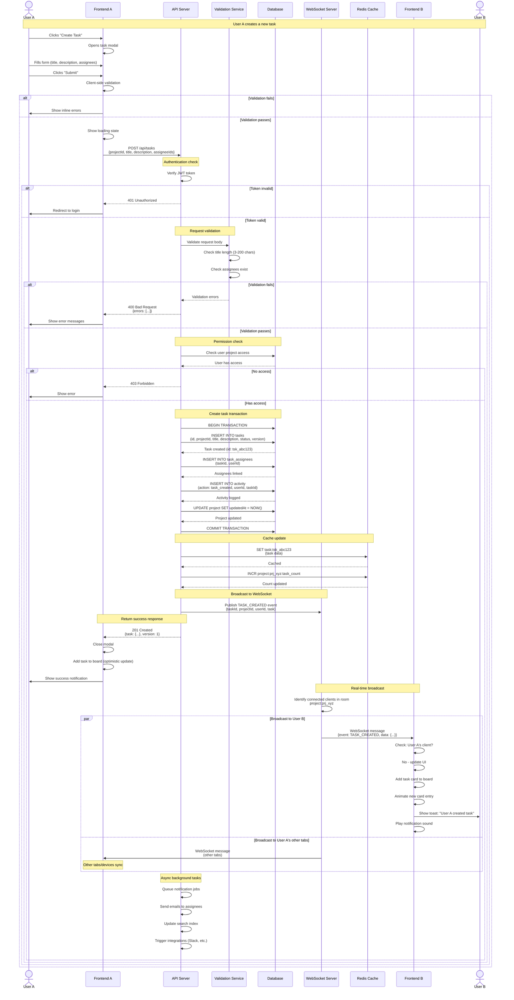

# TeamFlow System Interactions

This document contains sequence diagrams showing how different components of TeamFlow interact during various operations.

## Table of Contents
1. [Task Creation with Real-Time Sync](#1-task-creation-with-real-time-sync)
2. [AI Task Breakdown Flow](#2-ai-task-breakdown-flow)
3. [Sprint Planning with AI](#3-sprint-planning-with-ai)
4. [User Authentication Flow](#4-user-authentication-flow)
5. [Slack Integration Notification](#5-slack-integration-notification)
6. [Concurrent Task Edit Conflict](#6-concurrent-task-edit-conflict)
7. [OAuth Login Flow](#7-oauth-login-flow)
8. [File Upload to Task](#8-file-upload-to-task)
9. [Sprint Completion Flow](#9-sprint-completion-flow)
10. [Real-Time Presence Update](#10-real-time-presence-update)

---

## 1. Task Creation with Real-Time Sync

This diagram shows the complete flow of creating a task, from user interaction to real-time updates for all connected users.

### Key Points:
- **Optimistic Updates**: Frontend adds task immediately, confirmed by server response
- **Transaction Safety**: Database operations wrapped in transaction
- **Cache Strategy**: Redis caches task data and project counts
- **Real-Time Sync**: WebSocket broadcasts to all connected clients in project room
- **Background Jobs**: Notifications and integrations handled asynchronously
- **Error Handling**: Multiple validation and permission checks with appropriate errors

---

## 2. AI Task Breakdown Flow

This diagram shows how AI is used to break down a complex task into smaller subtasks.

```mermaid
sequenceDiagram
    actor User
    participant Frontend
    participant API as API Server
    participant Auth as Auth Service
    participant DB as Database
    participant Queue as Job Queue
    participant Worker as AI Worker
    participant AI as OpenAI/Anthropic API
    participant Cache as Redis Cache

    User->>Frontend: Clicks "AI Breakdown" on task
    Frontend->>Frontend: Show AI modal with task context
    User->>Frontend: Configures options<br/>(max subtasks, detail level)
    User->>Frontend: Clicks "Generate"

    Frontend->>Frontend: Disable button, show loading
    Frontend->>API: POST /api/tasks/:id/ai-breakdown<br/>{maxSubtasks: 10, detailLevel: "medium"}

    Note over API,Auth: Authentication & Authorization
    API->>Auth: Verify JWT token
    Auth-->>API: User authenticated

    API->>DB: Check user has task access
    DB-->>API: Access granted

    Note over API,Cache: Check AI quota
    API->>Cache: GET ai_quota:workspace:ws_xyz
    Cache-->>API: 15 requests remaining this hour

    alt Quota exceeded
        API-->>Frontend: 429 Too Many Requests<br/>{error: "AI quota exceeded"}
        Frontend->>Frontend: Show error modal
        Frontend->>User: Display quota limit message
    else Quota available
        API->>Cache: DECR ai_quota:workspace:ws_xyz
        Cache-->>API: 14 remaining

        Note over API,DB: Fetch task details
        API->>DB: SELECT * FROM tasks<br/>WHERE id = 'tsk_abc123'
        DB-->>API: Task data<br/>{title, description, project}

        API->>DB: SELECT * FROM subtasks<br/>WHERE taskId = 'tsk_abc123'
        DB-->>API: Existing subtasks (if any)

        Note over API,Queue: Queue AI job
        API->>Queue: Enqueue ai_breakdown job<br/>{taskId, userId, options}
        Queue-->>API: Job ID: job_xyz789

        API-->>Frontend: 202 Accepted<br/>{jobId: "job_xyz789", status: "processing"}

        Frontend->>Frontend: Show processing state
        Frontend->>Frontend: Poll for results

        Note over Queue,Worker: Background processing
        Queue->>Worker: Dispatch job job_xyz789

        Worker->>Worker: Load task context
        Worker->>DB: Get task, project, and sprint data
        DB-->>Worker: Context data

        Worker->>Worker: Build AI prompt
        Note over Worker: Prompt includes:<br/>- Task title & description<br/>- Project context<br/>- Existing subtasks<br/>- Team velocity<br/>- Detail level preference

        Worker->>AI: POST /v1/chat/completions<br/>{model: "gpt-4", messages: [...]}

        Note over AI: AI processing (2-5 seconds)
        AI->>AI: Analyze task
        AI->>AI: Generate subtasks
        AI->>AI: Estimate complexity

        alt AI service error
            AI-->>Worker: 500 Service Error
            Worker->>Worker: Log error
            Worker->>DB: UPDATE job status = 'failed'
            Worker->>Cache: SET job:job_xyz789:status "failed"
        else AI success
            AI-->>Worker: 200 OK<br/>{choices: [{message: {content: "..."}}]}

            Worker->>Worker: Parse AI response
            Worker->>Worker: Extract subtasks JSON
            Worker->>Worker: Validate suggestions
            Worker->>Worker: Calculate confidence scores

            Note over Worker,Cache: Cache results
            Worker->>Cache: SET job:job_xyz789:result<br/>{suggestions: [...]}
            Cache-->>Worker: Cached

            Worker->>Cache: SET job:job_xyz789:status "completed"
            Cache-->>Worker: Status updated

            Worker->>DB: INSERT INTO ai_usage<br/>(workspaceId, type, tokensUsed, cost)
            DB-->>Worker: Usage logged
        end

        Note over Frontend: Polling for results
        Frontend->>API: GET /api/jobs/job_xyz789/status
        API->>Cache: GET job:job_xyz789:status
        Cache-->>API: "completed"

        API->>Cache: GET job:job_xyz789:result
        Cache-->>API: {suggestions: [...]}

        API-->>Frontend: 200 OK<br/>{status: "completed", suggestions: [...]}

        Frontend->>Frontend: Stop polling
        Frontend->>Frontend: Display suggestions
        Frontend->>Frontend: Group by confidence (high/medium/low)
        Frontend->>User: Show interactive suggestion list

        User->>Frontend: Reviews suggestions
        User->>Frontend: Edits/reorders/removes suggestions
        User->>Frontend: Clicks "Create Subtasks"

        Frontend->>API: POST /api/tasks/:id/subtasks/batch<br/>{subtasks: [...]}

        Note over API,DB: Create subtasks
        API->>DB: BEGIN TRANSACTION

        loop For each subtask
            API->>DB: INSERT INTO subtasks<br/>(taskId, title, position, completed)
            DB-->>API: Subtask created
        end

        API->>DB: UPDATE tasks<br/>SET version = version + 1<br/>WHERE id = 'tsk_abc123'
        DB-->>API: Task updated

        API->>DB: INSERT INTO activity<br/>(action: ai_breakdown_applied)
        DB-->>API: Activity logged

        API->>DB: COMMIT TRANSACTION

        API-->>Frontend: 201 Created<br/>{subtasks: [...], task: {version: 2}}

        Frontend->>Frontend: Update task UI
        Frontend->>Frontend: Show subtasks checklist
        Frontend->>User: Show success message

        Note over API: Broadcast to WebSocket
        API->>Worker: Publish TASK_UPDATED event
        Worker->>Frontend: WebSocket: Task updated
        Frontend->>Frontend: Update other clients
    end
```

### Key Points:
- **Async Processing**: AI requests handled via job queue to avoid timeout
- **Quota Management**: Rate limiting for AI usage per workspace
- **Polling**: Frontend polls for job completion
- **Validation**: AI responses validated before returning to user
- **User Control**: User can review and modify AI suggestions before applying
- **Cost Tracking**: AI usage logged for billing/analytics
- **Error Recovery**: Graceful handling of AI service failures

---

## 3. Sprint Planning with AI

This diagram shows the AI-assisted sprint planning flow.

```mermaid
sequenceDiagram
    actor User
    participant Frontend
    participant API as API Server
    participant DB as Database
    participant Analytics as Analytics Service
    participant AI as AI Service
    participant Cache as Redis Cache

    User->>Frontend: Opens sprint planning view
    Frontend->>API: GET /api/sprints<br/>?projectId=prj_xyz&status=planning
    API->>DB: Fetch planning sprints
    DB-->>API: Sprint data
    API-->>Frontend: Sprints list

    User->>Frontend: Creates new sprint
    Frontend->>API: POST /api/sprints<br/>{name, startDate, endDate, goal}
    API->>DB: INSERT INTO sprints
    DB-->>API: Sprint created (spr_abc123)
    API-->>Frontend: Sprint data

    Frontend->>User: Show sprint details
    User->>Frontend: Clicks "AI Sprint Planning"

    Frontend->>Frontend: Open AI assistant modal
    Frontend->>Frontend: Show current context

    Note over Frontend,API: Fetch planning context
    par Fetch multiple data sources
        Frontend->>API: GET /api/analytics/project/:id/velocity
        API->>Analytics: Calculate team velocity
        Analytics->>DB: Query completed sprints
        DB-->>Analytics: Sprint history
        Analytics->>Analytics: Calculate average velocity
        Analytics-->>API: Velocity: 42 points/sprint
        API-->>Frontend: Velocity data
    and
        Frontend->>API: GET /api/tasks?projectId=prj_xyz&status=todo
        API->>Cache: Check cache
        Cache-->>API: Cache miss
        API->>DB: Query backlog tasks
        DB-->>API: 35 tasks
        API->>Cache: Cache backlog
        API-->>Frontend: Backlog tasks
    and
        Frontend->>API: GET /api/workspaces/:id/members
        API->>DB: Query team members
        DB-->>API: 8 active members
        API-->>Frontend: Team members
    end

    Frontend->>Frontend: Display planning context
    User->>Frontend: Configures AI parameters<br/>(team members, focus areas)
    User->>Frontend: Clicks "Generate Plan"

    Frontend->>API: POST /api/sprints/:id/ai-plan<br/>{teamVelocity: 42, teamMembers: [...], focusAreas: ["frontend"]}

    Note over API: Validate and prepare
    API->>DB: Check AI quota
    DB-->>API: Quota OK

    API->>DB: Fetch detailed context
    DB-->>API: Tasks with priorities, dependencies, estimates

    Note over API,AI: Call AI service
    API->>AI: Analyze sprint plan<br/>{backlog, velocity, team, constraints}

    Note over AI: AI Processing (3-7 seconds)
    AI->>AI: Analyze task complexity
    AI->>AI: Consider dependencies
    AI->>AI: Balance workload across team
    AI->>AI: Respect capacity constraints
    AI->>AI: Prioritize by business value
    AI->>AI: Generate recommendations

    alt AI service timeout
        AI-->>API: Timeout (30s exceeded)
        API-->>Frontend: 503 Service Unavailable<br/>{error: "AI service timeout"}
        Frontend->>User: Show retry option
    else AI service error
        AI-->>API: 500 Internal Error
        API-->>Frontend: 500 Error<br/>{error: "AI service failed"}
        Frontend->>User: Suggest manual planning
    else AI success
        AI-->>API: 200 OK<br/>{plan: {recommendedTasks, assignments, warnings}}

        Note over API: Process recommendations
        API->>API: Parse AI response
        API->>API: Validate task IDs exist
        API->>API: Validate user IDs exist
        API->>API: Calculate capacity utilization
        API->>API: Generate alternatives

        API->>DB: Log AI usage
        DB-->>API: Logged

        API-->>Frontend: 200 OK<br/>{plan: {...}, metadata: {...}}

        Frontend->>Frontend: Display recommendations
        Frontend->>Frontend: Group by priority<br/>(must-have, should-have, could-have)
        Frontend->>Frontend: Show team workload chart
        Frontend->>Frontend: Display capacity utilization
        Frontend->>Frontend: Show warnings (if overcommitted)

        Frontend->>User: Show interactive plan

        Note over User,Frontend: User reviews and modifies
        User->>Frontend: Drags tasks between groups
        Frontend->>Frontend: Recalculate metrics in real-time
        Frontend->>Frontend: Update capacity percentage
        Frontend->>Frontend: Update team balance chart

        User->>Frontend: Adjusts assignments
        Frontend->>Frontend: Update workload distribution

        User->>Frontend: Adds/removes tasks
        Frontend->>Frontend: Recalculate total points

        User->>Frontend: Satisfied with plan
        User->>Frontend: Clicks "Apply Plan"

        Frontend->>API: POST /api/sprints/:id/apply-ai-plan<br/>{selectedTasks: [...], assignments: {...}}

        Note over API,DB: Apply plan transaction
        API->>DB: BEGIN TRANSACTION

        API->>DB: Validate sprint still in planning
        DB-->>API: Status OK

        loop For each selected task
            API->>DB: INSERT INTO sprint_tasks<br/>(sprintId, taskId, addedAt)
            DB-->>API: Task added to sprint

            opt If assignment changed
                API->>DB: DELETE FROM task_assignees<br/>WHERE taskId = ?
                API->>DB: INSERT INTO task_assignees<br/>(taskId, userId)
                DB-->>API: Assignee updated
            end
        end

        API->>DB: UPDATE sprints<br/>SET totalStoryPoints = ?<br/>WHERE id = 'spr_abc123'
        DB-->>API: Sprint updated

        API->>DB: INSERT INTO activity<br/>(action: ai_sprint_planned, metadata)
        DB-->>API: Activity logged

        API->>DB: COMMIT TRANSACTION

        Note over API,Cache: Invalidate caches
        API->>Cache: DEL sprint:spr_abc123
        API->>Cache: DEL project:prj_xyz:backlog
        Cache-->>API: Caches cleared

        API-->>Frontend: 200 OK<br/>{sprint: {...}, addedTasks: 12}

        Frontend->>Frontend: Update sprint view
        Frontend->>Frontend: Show success animation
        Frontend->>User: "Sprint planned with AI - 12 tasks added"

        Note over API: Notify team
        API->>API: Queue notification jobs
        API->>API: Send emails to assigned members
        API->>API: Post to Slack (if integrated)

        Note over API: Broadcast via WebSocket
        API->>API: Publish SPRINT_UPDATED event
        Frontend->>Frontend: Other clients receive update
    end
```

### Key Points:
- **Context Gathering**: Parallel requests to fetch velocity, backlog, and team data
- **Real-Time Feedback**: Frontend recalculates metrics as user modifies plan
- **Validation**: Multiple validation steps before applying plan
- **Transaction Safety**: All changes in single database transaction
- **Team Notifications**: Automated notifications to affected team members
- **Cache Management**: Strategic cache invalidation after updates
- **Error Handling**: Graceful degradation if AI service unavailable

---

## 4. User Authentication Flow

This diagram shows the complete authentication flow with JWT tokens.

```mermaid
sequenceDiagram
    actor User
    participant Frontend
    participant API as API Server
    participant Auth as Auth Service
    participant DB as Database
    participant Redis as Redis Cache
    participant Email as Email Service

    Note over User,Email: Registration Flow

    User->>Frontend: Visits /register
    Frontend->>User: Show registration form

    User->>Frontend: Submits form<br/>(email, password, name)
    Frontend->>Frontend: Client-side validation

    Frontend->>API: POST /api/auth/register<br/>{email, password, name}

    API->>Auth: Validate request
    Auth->>Auth: Check email format
    Auth->>Auth: Check password strength

    alt Validation fails
        Auth-->>API: Validation errors
        API-->>Frontend: 400 Bad Request<br/>{errors: [...]}
        Frontend->>User: Show inline errors
    else Validation passes
        API->>DB: Check if email exists
        DB-->>API: Email not found

        alt Email exists
            API-->>Frontend: 409 Conflict<br/>{error: "Email already registered"}
            Frontend->>User: Show error message
        else Email available
            Auth->>Auth: Hash password (bcrypt, 10 rounds)
            Note over Auth: Password hashing takes ~100ms

            API->>DB: BEGIN TRANSACTION
            API->>DB: INSERT INTO users<br/>(email, passwordHash, name, emailVerified=false)
            DB-->>API: User created (usr_abc123)

            Auth->>Auth: Generate verification token
            API->>DB: INSERT INTO email_verifications<br/>(userId, token, expiresAt)
            DB-->>API: Token stored

            API->>DB: COMMIT TRANSACTION

            API->>Email: Send verification email<br/>{to, token, link}
            Email-->>API: Email queued

            API-->>Frontend: 201 Created<br/>{user: {id, email, name}, message: "Check email"}
            Frontend->>User: Show success message
            Frontend->>Frontend: Redirect to /verify-email
        end
    end

    Note over User,Email: Login Flow

    User->>Frontend: Visits /login
    Frontend->>User: Show login form

    User->>Frontend: Submits credentials<br/>(email, password)
    Frontend->>API: POST /api/auth/login<br/>{email, password, rememberMe}

    Note over API,Redis: Rate limit check
    API->>Redis: GET rate_limit:login:192.168.1.1
    Redis-->>API: 3 attempts in last hour

    alt Rate limit exceeded (>10)
        API-->>Frontend: 429 Too Many Requests
        Frontend->>User: Show rate limit error
    else Rate limit OK
        API->>Redis: INCR rate_limit:login:192.168.1.1
        API->>Redis: EXPIRE rate_limit:login:192.168.1.1 3600

        API->>DB: SELECT * FROM users<br/>WHERE email = ?

        alt User not found
            DB-->>API: No user found
            API-->>Frontend: 401 Unauthorized<br/>{error: "Invalid credentials"}
            Frontend->>User: Show error (same message for security)
        else User found
            DB-->>API: User data

            API->>API: Check account locked
            alt Account locked
                API-->>Frontend: 403 Forbidden<br/>{error: "Account locked", lockedUntil}
                Frontend->>User: Show lockout message
            else Account not locked
                API->>API: Check email verified
                alt Email not verified
                    API-->>Frontend: 403 Forbidden<br/>{error: "Email not verified"}
                    Frontend->>User: Show verification prompt
                else Email verified
                    Auth->>Auth: Compare password<br/>(bcrypt.compare)
                    Note over Auth: Password comparison takes ~100ms

                    alt Password incorrect
                        API->>DB: UPDATE users<br/>SET failedLoginAttempts = failedLoginAttempts + 1
                        DB-->>API: Attempts incremented

                        API->>DB: Check if attempts >= 5
                        alt Attempts >= 5
                            API->>DB: UPDATE users<br/>SET lockedUntil = NOW() + INTERVAL 15 MINUTE
                            DB-->>API: Account locked
                            API-->>Frontend: 403 Forbidden<br/>{error: "Account locked"}
                            Frontend->>User: Show lockout message
                        else Attempts < 5
                            API-->>Frontend: 401 Unauthorized
                            Frontend->>User: Show error
                        end
                    else Password correct
                        Note over Auth: Generate JWT tokens
                        Auth->>Auth: Create access token payload<br/>{userId, email, type: "access"}
                        Auth->>Auth: Sign with secret (exp: 15min)
                        Auth->>Auth: accessToken = jwt.sign(...)

                        alt Remember me checked
                            Auth->>Auth: Create refresh token (exp: 30 days)
                        else Remember me unchecked
                            Auth->>Auth: Create refresh token (exp: 7 days)
                        end

                        Auth->>Auth: refreshToken = jwt.sign(...)

                        Note over API,DB: Update user & store token
                        API->>DB: UPDATE users<br/>SET failedLoginAttempts = 0,<br/>lastLoginAt = NOW()
                        DB-->>API: User updated

                        API->>DB: INSERT INTO refresh_tokens<br/>(userId, token, expiresAt)
                        DB-->>API: Token stored

                        Note over API,Redis: Cache user session
                        API->>Redis: SET user:usr_abc123:session<br/>{userId, email, workspaces}
                        API->>Redis: EXPIRE user:usr_abc123:session 900
                        Redis-->>API: Session cached

                        API-->>Frontend: 200 OK<br/>{user, tokens: {accessToken, refreshToken, expiresIn}}

                        Frontend->>Frontend: Store accessToken in memory
                        Frontend->>Frontend: Store refreshToken in httpOnly cookie
                        Frontend->>Frontend: Set cookie attributes:<br/>- HttpOnly: true<br/>- Secure: true<br/>- SameSite: Strict

                        Frontend->>User: Redirect to dashboard
                    end
                end
            end
        end
    end

    Note over User,Redis: Authenticated Request Flow

    User->>Frontend: Navigates to /projects
    Frontend->>API: GET /api/projects<br/>Authorization: Bearer <accessToken>

    API->>API: Extract token from header

    alt Token missing
        API-->>Frontend: 401 Unauthorized
        Frontend->>Frontend: Redirect to login
    else Token present
        Note over API,Redis: Verify token
        API->>Redis: GET blacklist:<accessToken>
        Redis-->>API: Not blacklisted

        Auth->>Auth: jwt.verify(token, secret)

        alt Token expired
            Auth-->>API: TokenExpiredError
            API-->>Frontend: 401 Unauthorized<br/>{error: "TOKEN_EXPIRED"}

            Note over Frontend: Auto token refresh
            Frontend->>Frontend: Get refreshToken from cookie
            Frontend->>API: POST /api/auth/refresh<br/>{refreshToken}

            API->>DB: SELECT * FROM refresh_tokens<br/>WHERE token = ?
            DB-->>API: Token found

            alt Token expired or revoked
                API-->>Frontend: 401 Unauthorized
                Frontend->>Frontend: Clear tokens
                Frontend->>User: Redirect to login
            else Token valid
                Auth->>Auth: Generate new access token
                Auth->>Auth: Generate new refresh token

                API->>DB: UPDATE refresh_tokens<br/>SET token = newToken
                DB-->>API: Token updated

                API-->>Frontend: 200 OK<br/>{tokens: {...}}
                Frontend->>Frontend: Store new tokens

                Frontend->>API: Retry GET /api/projects<br/>with new token
                API->>API: Process request with new token
            end
        else Token valid
            Auth-->>API: Decoded payload<br/>{userId: "usr_abc123", email}

            Note over API,Redis: Check session cache
            API->>Redis: GET user:usr_abc123:session

            alt Cache hit
                Redis-->>API: User session data
                API->>API: Attach user to request context
            else Cache miss
                API->>DB: SELECT * FROM users<br/>WHERE id = 'usr_abc123'
                DB-->>API: User data
                API->>Redis: SET user:usr_abc123:session
                API->>API: Attach user to request context
            end

            API->>API: Process request
            API->>DB: Query projects
            DB-->>API: Projects data

            API-->>Frontend: 200 OK<br/>{projects: [...]}
            Frontend->>User: Display projects
        end
    end

    Note over User,Redis: Logout Flow

    User->>Frontend: Clicks logout
    Frontend->>API: POST /api/auth/logout<br/>Authorization: Bearer <token>

    API->>Redis: SET blacklist:<accessToken> "1"
    API->>Redis: EXPIRE blacklist:<accessToken> 900
    Redis-->>API: Token blacklisted

    API->>DB: DELETE FROM refresh_tokens<br/>WHERE userId = 'usr_abc123'
    DB-->>API: Tokens deleted

    API->>Redis: DEL user:usr_abc123:session
    Redis-->>API: Session cleared

    API-->>Frontend: 200 OK
    Frontend->>Frontend: Clear tokens from memory
    Frontend->>Frontend: Delete httpOnly cookie
    Frontend->>User: Redirect to login
```

### Key Points:
- **Password Security**: bcrypt hashing with 10 rounds (~100ms)
- **Account Lockout**: 5 failed attempts = 15 minute lock
- **Token Strategy**: Short-lived access tokens (15min), long-lived refresh tokens (7-30 days)
- **Secure Storage**: Access token in memory, refresh token in httpOnly cookie
- **Rate Limiting**: Redis-based rate limiting on login endpoint
- **Token Refresh**: Automatic token refresh on expiration
- **Session Caching**: User session cached in Redis for fast auth checks
- **Token Blacklist**: Logout blacklists token to prevent reuse
- **Security Headers**: Secure, HttpOnly, SameSite cookies

---

## 5. Slack Integration Notification

This diagram shows how task updates trigger Slack notifications.

```mermaid
sequenceDiagram
    actor User
    participant Frontend
    participant API as API Server
    participant DB as Database
    participant Queue as Job Queue
    participant Worker as Integration Worker
    participant IntegrationDB as Integration Config
    participant Slack as Slack API

    Note over User,Slack: Task status change triggers notification

    User->>Frontend: Drags task to "Done" column
    Frontend->>Frontend: Optimistic UI update

    Frontend->>API: PUT /api/tasks/tsk_abc123<br/>{status: "done", version: 3}

    API->>DB: BEGIN TRANSACTION
    API->>DB: UPDATE tasks<br/>SET status = 'done', version = 4<br/>WHERE id = 'tsk_abc123' AND version = 3

    alt Version mismatch
        DB-->>API: 0 rows affected
        API->>DB: ROLLBACK
        API-->>Frontend: 409 Conflict
        Frontend->>Frontend: Revert optimistic update
        Frontend->>User: Show conflict modal
    else Update successful
        DB-->>API: Task updated

        API->>DB: INSERT INTO activity<br/>(action: status_changed, taskId, userId, changes)
        DB-->>API: Activity logged

        API->>DB: COMMIT TRANSACTION

        Note over API: Check for integrations
        API->>DB: SELECT * FROM integrations<br/>WHERE workspaceId = 'ws_xyz'<br/>AND type = 'slack'<br/>AND status = 'connected'

        alt No Slack integration
            DB-->>API: No integrations found
            API->>API: Skip notification
        else Slack integration exists
            DB-->>API: Integration config<br/>{id, webhookUrl, channels, settings}

            Note over API,Queue: Queue notification job
            API->>Queue: Enqueue slack_notification<br/>{taskId, action: "status_changed", integrationId}
            Queue-->>API: Job queued
        end

        API-->>Frontend: 200 OK<br/>{task: {...}, version: 4}
        Frontend->>User: Show success

        Note over Queue,Worker: Background processing
        Queue->>Worker: Dispatch slack_notification job

        Worker->>DB: Fetch full task details
        DB-->>Worker: Task with relations<br/>(assignees, project, labels)

        Worker->>IntegrationDB: Fetch integration config
        IntegrationDB-->>Worker: Slack config<br/>{webhookUrl, channels, settings}

        Worker->>Worker: Check notification rules
        Note over Worker: Rules:<br/>- Only notify on done/blocked<br/>- Respect quiet hours<br/>- Check channel preferences

        alt Notification should be skipped
            Worker->>Worker: Log skip reason
            Worker->>Worker: Mark job complete
        else Send notification
            Worker->>Worker: Build Slack message
            Note over Worker: Format Slack Block Kit message

            Worker->>Worker: Create message blocks:<br/>- Header with task title<br/>- Status badge<br/>- Assignee info<br/>- Link to task

            Worker->>Worker: Format message
            Note over Worker: Example message structure:

            Worker->>Slack: POST https://hooks.slack.com/services/...<br/>{blocks: [...], text: "Task completed"}

            Note over Slack: Slack processes webhook (< 1s)

            alt Slack API error
                Slack-->>Worker: 400 Bad Request<br/>{error: "invalid_blocks"}
                Worker->>Worker: Log error
                Worker->>Worker: Retry with simpler format

                Worker->>Slack: POST with text-only message
                Slack-->>Worker: 200 OK
            else Slack rate limit
                Slack-->>Worker: 429 Too Many Requests<br/>{retry_after: 30}
                Worker->>Queue: Requeue job with delay (30s)
                Queue-->>Worker: Job requeued
            else Slack webhook invalid
                Slack-->>Worker: 404 Not Found
                Worker->>Worker: Log critical error

                Note over Worker,IntegrationDB: Mark integration as failed
                Worker->>IntegrationDB: UPDATE integrations<br/>SET status = 'failed',<br/>lastError = 'Webhook invalid'
                IntegrationDB-->>Worker: Integration marked failed

                Worker->>DB: INSERT INTO notifications<br/>(type: 'integration_failed', workspaceId)
                DB-->>Worker: Admin notification created
            else Success
                Slack-->>Worker: 200 OK

                Note over Slack: Message posted to #general
                Slack->>Slack: Display notification in channel

                Worker->>Worker: Log success
                Worker->>IntegrationDB: UPDATE integrations<br/>SET lastSyncAt = NOW(),<br/>status = 'connected'
                IntegrationDB-->>Worker: Integration updated

                Worker->>DB: INSERT INTO integration_logs<br/>(integrationId, action, success, timestamp)
                DB-->>Worker: Log recorded

                Worker->>Worker: Mark job complete
            end
        end
    end

    Note over Slack: Slack user interactions

    par Slack users see notification
        Slack->>Slack: @john sees notification
        Slack->>Slack: Can click link to view task
    and
        Slack->>Slack: @jane sees notification
        Slack->>Slack: Reacts with 🎉 emoji
    end
```

### Key Points:
- **Async Processing**: Integration notifications queued for background processing
- **Retry Logic**: Failed notifications retried with exponential backoff
- **Rate Limiting**: Respects Slack API rate limits
- **Error Handling**: Marks integration as failed if webhook invalid
- **Message Formatting**: Uses Slack Block Kit for rich messages
- **Notification Rules**: Configurable rules for when to send notifications
- **Logging**: All integration activity logged for debugging
- **Graceful Degradation**: Falls back to simple text if blocks fail

---

## 6. Concurrent Task Edit Conflict

This diagram shows how the system handles two users editing the same task simultaneously.

```mermaid
sequenceDiagram
    actor UserA as User A
    participant FrontendA as Frontend A
    participant API as API Server
    participant DB as Database
    participant WS as WebSocket Server
    participant FrontendB as Frontend B
    actor UserB as User B

    Note over UserA,UserB: Both users open same task

    par Users fetch task
        UserA->>FrontendA: Opens task details
        FrontendA->>API: GET /api/tasks/tsk_abc123
        API->>DB: SELECT * FROM tasks WHERE id = ?
        DB-->>API: Task data (version: 5)
        API-->>FrontendA: Task data
        FrontendA->>UserA: Display task (version 5)
    and
        UserB->>FrontendB: Opens task details
        FrontendB->>API: GET /api/tasks/tsk_abc123
        API->>DB: SELECT * FROM tasks WHERE id = ?
        DB-->>API: Task data (version: 5)
        API-->>FrontendB: Task data
        FrontendB->>UserB: Display task (version 5)
    end

    Note over UserA,UserB: Both users start editing

    UserA->>FrontendA: Changes title to "Design Homepage v2"
    FrontendA->>FrontendA: Update local state
    FrontendA->>FrontendA: Show unsaved indicator

    UserB->>FrontendB: Changes priority to "high"
    FrontendB->>FrontendB: Update local state
    FrontendB->>FrontendB: Show unsaved indicator

    Note over FrontendA,FrontendB: User A saves first

    UserA->>FrontendA: Clicks "Save"
    FrontendA->>FrontendA: Disable save button

    FrontendA->>API: PUT /api/tasks/tsk_abc123<br/>{title: "Design Homepage v2", version: 5}

    Note over API,DB: Optimistic locking check
    API->>DB: BEGIN TRANSACTION
    API->>DB: SELECT version FROM tasks<br/>WHERE id = 'tsk_abc123' FOR UPDATE
    DB-->>API: Current version: 5

    API->>API: Compare versions: 5 == 5 ✓

    API->>DB: UPDATE tasks<br/>SET title = 'Design Homepage v2',<br/>version = 6,<br/>updatedAt = NOW()<br/>WHERE id = 'tsk_abc123' AND version = 5
    DB-->>API: 1 row updated

    API->>DB: INSERT INTO activity<br/>(action: updated, field: title, oldValue, newValue)
    DB-->>API: Activity logged

    API->>DB: COMMIT TRANSACTION

    API-->>FrontendA: 200 OK<br/>{task: {...}, version: 6}

    FrontendA->>FrontendA: Update local version to 6
    FrontendA->>FrontendA: Clear unsaved indicator
    FrontendA->>UserA: Show "Saved" success message

    Note over API,WS: Broadcast update to other clients
    API->>WS: Publish TASK_UPDATED event<br/>{taskId, changes: {title}, version: 6, userId: A}

    WS->>FrontendB: WebSocket message<br/>{event: TASK_UPDATED, data: {...}}

    Note over FrontendB: Detect potential conflict
    FrontendB->>FrontendB: Check: Has local unsaved changes? YES
    FrontendB->>FrontendB: Check: Same field edited? NO
    FrontendB->>FrontendB: Merge changes automatically
    FrontendB->>FrontendB: Update title to "Design Homepage v2"
    FrontendB->>FrontendB: Update local version to 6
    FrontendB->>FrontendB: Keep priority change in local state
    FrontendB->>UserB: Show toast: "User A updated task"

    Note over FrontendB,UserB: User B tries to save

    UserB->>FrontendB: Clicks "Save"
    FrontendB->>FrontendB: Disable save button

    FrontendB->>API: PUT /api/tasks/tsk_abc123<br/>{priority: "high", version: 6}

    Note over API,DB: Optimistic locking check
    API->>DB: BEGIN TRANSACTION
    API->>DB: SELECT version FROM tasks<br/>WHERE id = 'tsk_abc123' FOR UPDATE
    DB-->>API: Current version: 6

    API->>API: Compare versions: 6 == 6 ✓

    API->>DB: UPDATE tasks<br/>SET priority = 'high',<br/>version = 7,<br/>updatedAt = NOW()<br/>WHERE id = 'tsk_abc123' AND version = 6
    DB-->>API: 1 row updated

    API->>DB: INSERT INTO activity
    DB-->>API: Activity logged

    API->>DB: COMMIT TRANSACTION

    API-->>FrontendB: 200 OK<br/>{task: {...}, version: 7}

    FrontendB->>FrontendB: Update local version to 7
    FrontendB->>UserB: Show "Saved" success message

    Note over API,WS: Broadcast to User A
    API->>WS: Publish TASK_UPDATED event<br/>{taskId, changes: {priority}, version: 7, userId: B}

    WS->>FrontendA: WebSocket message
    FrontendA->>FrontendA: Update priority to "high"
    FrontendA->>FrontendA: Update version to 7
    FrontendA->>UserA: Show toast: "User B updated task"

    Note over UserA,UserB: Scenario: Conflicting field edit

    UserA->>FrontendA: Changes description
    UserB->>FrontendB: Also changes description (different text)

    UserA->>FrontendA: Clicks Save
    FrontendA->>API: PUT /api/tasks/tsk_abc123<br/>{description: "A's version", version: 7}

    API->>DB: UPDATE tasks<br/>SET description = "A's version",<br/>version = 8<br/>WHERE version = 7
    DB-->>API: Updated

    API-->>FrontendA: 200 OK (version: 8)
    API->>WS: Broadcast TASK_UPDATED (version: 8)
    WS->>FrontendB: Task updated by User A

    FrontendB->>FrontendB: Detect conflict:<br/>- Has unsaved changes in description<br/>- Remote update also changed description<br/>- Same field conflict!

    FrontendB->>FrontendB: Store local changes in temp
    FrontendB->>FrontendB: Update to remote version 8

    UserB->>FrontendB: Clicks Save
    FrontendB->>API: PUT /api/tasks/tsk_abc123<br/>{description: "B's version", version: 8}

    API->>DB: BEGIN TRANSACTION
    API->>DB: SELECT version WHERE id = ? FOR UPDATE
    DB-->>API: version: 8

    API->>API: Compare: 8 == 8 ✓

    API->>DB: UPDATE tasks<br/>SET description = "B's version",<br/>version = 9<br/>WHERE version = 8
    DB-->>API: Updated

    API->>DB: COMMIT
    API-->>FrontendB: 200 OK (version: 9)

    Note over FrontendB: User B's save succeeds (last write wins)

    FrontendB->>UserB: Show "Saved"

    API->>WS: Broadcast TASK_UPDATED (version: 9)
    WS->>FrontendA: Task updated by User B

    FrontendA->>FrontendA: Description changed by User B
    FrontendA->>FrontendA: User A's previous change overwritten
    FrontendA->>UserA: Show notification:<br/>"User B updated description"

    Note over UserA,UserB: Scenario: Stale version conflict

    UserA->>FrontendA: Loses network connection
    FrontendA->>FrontendA: Offline mode
    UserA->>FrontendA: Makes changes offline

    UserB->>FrontendB: Makes changes online
    FrontendB->>API: PUT (version: 9)
    API->>DB: UPDATE version to 10
    API-->>FrontendB: Success (version: 10)

    UserA->>FrontendA: Network restored
    UserA->>FrontendA: Clicks Save

    FrontendA->>API: PUT /api/tasks/tsk_abc123<br/>{changes..., version: 9}

    API->>DB: BEGIN TRANSACTION
    API->>DB: SELECT version WHERE id = ?
    DB-->>API: version: 10

    API->>API: Compare: 9 != 10 ✗ CONFLICT!

    API->>DB: ROLLBACK

    API-->>FrontendA: 409 Conflict<br/>{error: "VERSION_CONFLICT",<br/>currentVersion: 10,<br/>currentTask: {...}}

    FrontendA->>FrontendA: Show conflict resolution modal
    FrontendA->>FrontendA: Display three-way diff:<br/>1. Your changes<br/>2. Remote changes<br/>3. Base version

    FrontendA->>UserA: Show conflict modal with options:<br/>- Use your version<br/>- Use remote version<br/>- Merge changes manually

    UserA->>FrontendA: Selects "Merge manually"
    FrontendA->>FrontendA: Show merge editor
    UserA->>FrontendA: Resolves conflicts
    UserA->>FrontendA: Clicks "Save merged version"

    FrontendA->>API: PUT /api/tasks/tsk_abc123<br/>{mergedChanges..., version: 10}

    API->>DB: UPDATE WHERE version = 10
    DB-->>API: Updated to version 11
    API-->>FrontendA: 200 OK (version: 11)

    FrontendA->>UserA: Show "Conflicts resolved"
```

### Key Points:
- **Optimistic Locking**: Version field prevents lost updates
- **Automatic Merging**: Non-conflicting changes merged automatically
- **Conflict Detection**: Same-field edits detected and handled
- **Real-Time Awareness**: WebSocket updates inform users of changes
- **Conflict Resolution UI**: Three-way diff for manual resolution
- **Last Write Wins**: For same-field edits, last save wins (with notification)
- **Transaction Safety**: Database row locks prevent race conditions
- **Offline Support**: Handles reconnection with stale version detection

---

## 7. OAuth Login Flow

This diagram shows the OAuth login flow with Google.

```mermaid
sequenceDiagram
    actor User
    participant Frontend
    participant API as API Server
    participant Google as Google OAuth
    participant DB as Database
    participant Auth as Auth Service

    User->>Frontend: Clicks "Continue with Google"

    Frontend->>Frontend: Generate state parameter<br/>(CSRF protection)
    Frontend->>Frontend: Store state in sessionStorage

    Frontend->>Frontend: Build OAuth URL:<br/>- client_id<br/>- redirect_uri<br/>- scope<br/>- state

    Frontend->>Google: Redirect to Google OAuth<br/>https://accounts.google.com/o/oauth2/v2/auth?...

    Note over User,Google: User at Google consent screen

    Google->>User: Show consent screen:<br/>- TeamFlow wants access to:<br/>  - Email<br/>  - Profile<br/>  - Avatar

    alt User denies consent
        User->>Google: Clicks "Cancel"
        Google->>Frontend: Redirect with error<br/>?error=access_denied
        Frontend->>User: Show "Sign in cancelled"
    else User grants consent
        User->>Google: Clicks "Allow"

        Google->>Google: Generate auth code
        Google->>Frontend: Redirect to callback<br/>?code=AUTH_CODE&state=STATE_VALUE

        Frontend->>Frontend: Verify state matches

        alt State mismatch (CSRF attack)
            Frontend->>User: Show security error
        else State valid
            Frontend->>Frontend: Extract auth code
            Frontend->>Frontend: Show "Signing in..."

            Frontend->>API: POST /api/auth/oauth/google<br/>{code: "AUTH_CODE", redirectUri}

            Note over API,Google: Exchange code for tokens
            API->>Google: POST /token<br/>{code, client_id, client_secret, redirect_uri}

            alt Invalid code or expired
                Google-->>API: 400 Bad Request
                API-->>Frontend: 401 Unauthorized
                Frontend->>User: Show "Authentication failed"
            else Code valid
                Google-->>API: 200 OK<br/>{access_token, id_token, refresh_token}

                Note over API: Verify ID token
                API->>API: Decode JWT id_token
                API->>API: Verify signature with Google public key
                API->>API: Verify issuer, audience, expiration

                API->>API: Extract user info:<br/>- email<br/>- name<br/>- picture (avatar)<br/>- sub (Google user ID)

                Note over API,DB: Find or create user
                API->>DB: SELECT * FROM users<br/>WHERE email = ? OR<br/>(provider = 'google' AND providerId = ?)

                alt User exists with email provider
                    DB-->>API: User found (email provider)
                    API-->>Frontend: 409 Conflict<br/>{error: "Email registered with password.<br/>Please use email/password login"}
                    Frontend->>User: Show error with login link
                else User exists with Google
                    DB-->>API: User found (Google provider)

                    API->>DB: UPDATE users<br/>SET lastLoginAt = NOW(),<br/>failedLoginAttempts = 0
                    DB-->>API: User updated

                    Note over API,Auth: Generate JWT tokens
                    Auth->>Auth: Create access token
                    Auth->>Auth: Create refresh token

                    API->>DB: INSERT INTO refresh_tokens
                    DB-->>API: Token stored

                    API-->>Frontend: 200 OK<br/>{user, tokens, isNewUser: false}
                    Frontend->>Frontend: Store tokens
                    Frontend->>User: Redirect to dashboard
                else User doesn't exist
                    Note over API,DB: Create new user
                    API->>DB: BEGIN TRANSACTION

                    API->>DB: INSERT INTO users<br/>(email, name, avatar, provider,<br/>providerId, emailVerified=true,<br/>passwordHash=null)
                    DB-->>API: User created (usr_abc123)

                    API->>DB: INSERT INTO oauth_accounts<br/>(userId, provider, providerAccountId,<br/>accessToken, refreshToken)
                    DB-->>API: OAuth account linked

                    API->>DB: COMMIT TRANSACTION

                    Note over API,Auth: Generate JWT tokens
                    Auth->>Auth: Create tokens for new user

                    API->>DB: INSERT INTO refresh_tokens
                    DB-->>API: Token stored

                    API-->>Frontend: 200 OK<br/>{user, tokens, isNewUser: true}

                    Frontend->>Frontend: Store tokens
                    Frontend->>User: Redirect to onboarding
                end
            end
        end
    end
```

### Key Points:
- **CSRF Protection**: State parameter prevents CSRF attacks
- **Token Exchange**: Auth code exchanged for access/refresh tokens
- **ID Token Verification**: JWT signature and claims verified
- **User Linking**: Prevents duplicate accounts with same email
- **Auto-Verification**: OAuth users have email pre-verified
- **Error Handling**: Clear messages for various failure scenarios

---

## 8. File Upload to Task

This diagram shows the file upload flow with progress tracking.

```mermaid
sequenceDiagram
    actor User
    participant Frontend
    participant API as API Server
    participant Storage as S3/R2 Storage
    participant DB as Database
    participant Virus as Virus Scanner

    User->>Frontend: Drags file onto task
    Frontend->>Frontend: Validate file:<br/>- Size < 10MB<br/>- Allowed MIME type<br/>- Total task attachments < 50MB

    alt Validation fails
        Frontend->>User: Show error message
    else Validation passes
        Frontend->>Frontend: Generate upload ID
        Frontend->>Frontend: Show progress bar (0%)

        Note over Frontend,API: Request presigned upload URL
        Frontend->>API: POST /api/tasks/:id/attachments/presigned<br/>{filename, mimeType, size}

        API->>API: Validate request
        API->>DB: Check user has task access
        DB-->>API: Access granted

        API->>DB: Check task attachment limit
        DB-->>API: Under limit (35MB / 50MB used)

        API->>Storage: Generate presigned PUT URL<br/>(expires in 5 minutes)
        Storage-->>API: Presigned URL

        API->>DB: INSERT INTO pending_attachments<br/>(id, taskId, filename, uploadUrl)
        DB-->>API: Pending attachment created

        API-->>Frontend: 200 OK<br/>{uploadId, presignedUrl, uploadUrl}

        Note over Frontend,Storage: Direct upload to storage
        Frontend->>Storage: PUT to presigned URL<br/>Content-Type: application/pdf<br/>[file binary data]

        loop Upload progress
            Storage-->>Frontend: Upload progress events
            Frontend->>Frontend: Update progress bar (25%...50%...75%)
            Frontend->>User: Show upload progress
        end

        alt Upload fails
            Storage-->>Frontend: Network error or timeout
            Frontend->>Frontend: Show retry button
            Frontend->>User: Show error message

            opt User retries
                User->>Frontend: Clicks retry
                Frontend->>API: Request new presigned URL
                API->>Storage: Generate new URL
                API-->>Frontend: New presigned URL
                Frontend->>Storage: Retry upload
            end
        else Upload succeeds
            Storage-->>Frontend: 200 OK
            Frontend->>Frontend: Update progress (100%)
            Frontend->>User: Show "Processing..."

            Note over Frontend,API: Confirm upload
            Frontend->>API: POST /api/tasks/:id/attachments/:uploadId/confirm

            API->>Storage: Verify file exists
            Storage-->>API: File confirmed

            API->>Storage: Get file metadata
            Storage-->>API: {size, etag, contentType}

            Note over API,Virus: Virus scan
            API->>Virus: Queue virus scan job<br/>{fileUrl, uploadId}

            par Process attachment
                Note over Virus: Async virus scanning
                Virus->>Storage: Download file
                Storage-->>Virus: File data
                Virus->>Virus: Scan file (ClamAV)

                alt Virus detected
                    Virus->>Storage: Delete file
                    Virus->>DB: UPDATE pending_attachments<br/>SET status = 'virus_detected'
                    Virus->>API: Notify virus detected
                    API->>Frontend: WebSocket: ATTACHMENT_VIRUS_DETECTED
                    Frontend->>User: Show virus alert
                else File clean
                    Virus->>DB: UPDATE pending_attachments<br/>SET status = 'clean'
                end
            and
                Note over API,DB: Create attachment record
                API->>DB: BEGIN TRANSACTION

                API->>DB: INSERT INTO attachments<br/>(id, taskId, filename, url, mimeType, size, uploadedBy)
                DB-->>API: Attachment created (att_abc123)

                API->>DB: UPDATE tasks<br/>SET version = version + 1,<br/>updatedAt = NOW()
                DB-->>API: Task updated

                API->>DB: INSERT INTO activity<br/>(action: attachment_added)
                DB-->>API: Activity logged

                API->>DB: DELETE FROM pending_attachments<br/>WHERE id = uploadId
                DB-->>API: Pending record removed

                API->>DB: COMMIT TRANSACTION

                API-->>Frontend: 201 Created<br/>{attachment: {...}}

                Frontend->>Frontend: Hide progress bar
                Frontend->>Frontend: Add attachment to list
                Frontend->>User: Show "Upload complete"

                Note over API: Broadcast via WebSocket
                API->>API: Publish TASK_UPDATED event
                Frontend->>Frontend: Other clients see new attachment
            end
        end
    end
```

### Key Points:
- **Presigned URLs**: Direct browser-to-S3 upload (no proxy through API)
- **Progress Tracking**: Real-time upload progress displayed to user
- **Size Limits**: 10MB per file, 50MB total per task
- **Virus Scanning**: Async virus scanning with ClamAV
- **Error Recovery**: Retry mechanism for failed uploads
- **Transaction Safety**: Database updates in transaction
- **Real-Time Sync**: WebSocket broadcasts attachment to other users

---

## 9. Sprint Completion Flow

This diagram shows the complete sprint completion process.

```mermaid
sequenceDiagram
    actor User
    participant Frontend
    participant API as API Server
    participant DB as Database
    participant Analytics as Analytics Service
    participant Email as Email Service
    participant WS as WebSocket

    User->>Frontend: Clicks "Complete Sprint"
    Frontend->>Frontend: Show completion modal

    Frontend->>API: GET /api/sprints/:id
    API->>DB: Fetch sprint details
    DB-->>API: Sprint data + tasks
    API-->>Frontend: Sprint info

    Frontend->>Frontend: Analyze sprint state
    Frontend->>Frontend: Count:<br/>- 10 completed tasks<br/>- 2 in-progress tasks<br/>- 1 todo task

    Frontend->>User: Show incomplete tasks (3)
    Frontend->>User: Ask: What to do with incomplete tasks?<br/>Options:<br/>1. Move to backlog<br/>2. Move to next sprint<br/>3. Keep in this sprint

    User->>Frontend: Selects "Move to backlog" for 2 tasks<br/>Selects "Move to next sprint" for 1 task
    User->>Frontend: Clicks "Complete Sprint"

    Frontend->>API: POST /api/sprints/:id/complete<br/>{incompleteTasks: {<br/>  tsk_001: "backlog",<br/>  tsk_002: "backlog",<br/>  tsk_003: "next_sprint"<br/>}}

    Note over API,DB: Validate sprint state
    API->>DB: SELECT status FROM sprints<br/>WHERE id = 'spr_abc'
    DB-->>API: status: "active"

    alt Sprint not active
        API-->>Frontend: 400 Bad Request<br/>{error: "Sprint not active"}
        Frontend->>User: Show error
    else Sprint is active
        API->>DB: Check permissions
        DB-->>API: User is admin

        Note over API,DB: Begin completion transaction
        API->>DB: BEGIN TRANSACTION

        Note over API,DB: Handle incomplete tasks
        loop For each incomplete task
            alt Move to backlog
                API->>DB: DELETE FROM sprint_tasks<br/>WHERE sprintId = ? AND taskId = ?
                DB-->>API: Task removed from sprint
            else Move to next sprint
                API->>DB: SELECT id FROM sprints<br/>WHERE projectId = ? AND startDate > ?<br/>ORDER BY startDate LIMIT 1
                DB-->>API: Next sprint: spr_def

                alt Next sprint exists
                    API->>DB: UPDATE sprint_tasks<br/>SET sprintId = 'spr_def'<br/>WHERE sprintId = ? AND taskId = ?
                    DB-->>API: Task moved to next sprint
                else No next sprint
                    API->>DB: DELETE FROM sprint_tasks
                    DB-->>API: Task moved to backlog
                end
            else Keep in sprint
                API->>DB: No action needed
            end
        end

        Note over API,Analytics: Calculate sprint metrics
        API->>DB: SELECT COUNT(*), SUM(storyPoints)<br/>FROM tasks t<br/>JOIN sprint_tasks st ON t.id = st.taskId<br/>WHERE st.sprintId = ?<br/>GROUP BY t.status
        DB-->>API: Aggregated task data

        Analytics->>Analytics: Calculate metrics:<br/>- Total tasks: 13<br/>- Completed: 10 (77%)<br/>- Total points: 55<br/>- Completed points: 47<br/>- Velocity: 47

        API->>DB: SELECT createdAt, updatedAt, status<br/>FROM tasks WHERE id IN (...)<br/>ORDER BY updatedAt
        DB-->>API: Task history

        Analytics->>Analytics: Calculate:<br/>- Average cycle time: 4.2 days<br/>- Average lead time: 6.8 days<br/>- Completion rate: 77%

        API->>DB: SELECT date, remainingPoints<br/>FROM sprint_burndown<br/>WHERE sprintId = ?
        DB-->>API: Burndown data

        Analytics->>Analytics: Analyze burndown:<br/>- On track: Yes<br/>- Velocity trend: Increasing

        Note over API,DB: Update sprint record
        API->>DB: UPDATE sprints SET<br/>status = 'completed',<br/>actualEndDate = NOW(),<br/>metrics = ?<br/>WHERE id = 'spr_abc'

        DB-->>API: Sprint updated

        Note over API,DB: Generate sprint report
        API->>DB: INSERT INTO sprint_reports<br/>(sprintId, metrics, summary, recommendations)
        DB-->>API: Report created

        API->>DB: INSERT INTO activity<br/>(action: sprint_completed, userId, sprintId)
        DB-->>API: Activity logged

        Note over API,DB: Update project velocity
        API->>DB: SELECT AVG(completedStoryPoints)<br/>FROM sprints<br/>WHERE projectId = ?<br/>AND status = 'completed'<br/>LIMIT 5
        DB-->>API: Average velocity: 44 points

        API->>DB: UPDATE projects<br/>SET velocity = 44<br/>WHERE id = ?
        DB-->>API: Project velocity updated

        API->>DB: COMMIT TRANSACTION

        Note over API: Prepare response
        API-->>Frontend: 200 OK<br/>{sprint: {...}, report: {...}}

        Frontend->>Frontend: Show sprint report modal
        Frontend->>Frontend: Display metrics:<br/>- Velocity chart<br/>- Completion rate<br/>- Burndown chart<br/>- Team performance
        Frontend->>User: Show celebration animation 🎉
        Frontend->>User: Display sprint report

        Note over API,Email: Send notifications
        par Notify team members
            API->>DB: SELECT DISTINCT userId<br/>FROM sprint_tasks st<br/>JOIN task_assignees ta ON st.taskId = ta.taskId<br/>WHERE st.sprintId = ?
            DB-->>API: Team member IDs

            loop For each team member
                API->>Email: Queue sprint completion email<br/>{userId, sprintReport}
                Email-->>API: Email queued
            end
        and
            Note over API,WS: Broadcast to WebSocket
            API->>WS: Publish SPRINT_COMPLETED event<br/>{sprintId, projectId, metrics}

            WS->>Frontend: Broadcast to all project members
            Frontend->>Frontend: Update sprint list
            Frontend->>Frontend: Update project metrics
            Frontend->>Frontend: Show notification
        end

        Note over Frontend: Prompt for retrospective
        Frontend->>User: Show prompt:<br/>"Schedule sprint retrospective?"<br/>[Schedule Meeting] [Skip]

        opt User schedules retrospective
            User->>Frontend: Clicks "Schedule Meeting"
            Frontend->>Frontend: Open retrospective form
            Frontend->>Frontend: Prefill with sprint report data
        end
    end
```

### Key Points:
- **State Validation**: Ensures sprint is active before completion
- **Task Handling**: Flexible options for incomplete tasks
- **Metrics Calculation**: Comprehensive sprint analytics computed
- **Transaction Safety**: All updates in single transaction
- **Team Notifications**: Automated emails to sprint participants
- **Real-Time Updates**: WebSocket broadcasts completion to all users
- **Report Generation**: Automatic sprint report with insights
- **Project Velocity**: Updates rolling average velocity

---

## 10. Real-Time Presence Update

This diagram shows how user presence (online/offline/typing) is tracked.

```mermaid
sequenceDiagram
    actor User
    participant Frontend
    participant WS as WebSocket Server
    participant Redis as Redis Cache
    participant PubSub as Redis Pub/Sub
    participant OtherClients as Other Clients

    Note over User,OtherClients: User connects to WebSocket

    User->>Frontend: Opens TeamFlow
    Frontend->>Frontend: Get access token

    Frontend->>WS: WebSocket connect<br/>wss://api.teamflow.app/ws?token=...

    WS->>WS: Verify JWT token
    WS->>WS: Extract userId: usr_abc123

    WS->>WS: Generate connectionId: conn_xyz789

    Note over WS,Redis: Register user session
    WS->>Redis: SADD user:usr_abc123:connections conn_xyz789
    Redis-->>WS: Connection registered

    WS->>Redis: SET connection:conn_xyz789<br/>{userId, workspaceId, projectId, connectedAt}
    WS->>Redis: EXPIRE connection:conn_xyz789 300
    Redis-->>WS: Connection data stored

    WS->>Redis: SET user:usr_abc123:status "online"
    Redis-->>WS: Status set

    WS-->>Frontend: Connection established

    Frontend->>WS: JOIN rooms:<br/>["workspace:ws_xyz", "project:prj_abc"]

    WS->>Redis: SADD room:workspace:ws_xyz conn_xyz789
    WS->>Redis: SADD room:project:prj_abc conn_xyz789
    Redis-->>WS: Joined rooms

    Note over WS,PubSub: Broadcast user online
    WS->>PubSub: PUBLISH presence:workspace:ws_xyz<br/>{event: "USER_ONLINE", userId, userName}

    PubSub->>OtherClients: Distribute to subscribers
    OtherClients->>OtherClients: Show "User A is online"
    OtherClients->>OtherClients: Add green dot to avatar

    Note over User,OtherClients: User starts typing in task comment

    User->>Frontend: Focuses comment field
    User->>Frontend: Types "Great work on..."

    Frontend->>Frontend: Debounce typing event (500ms)
    Frontend->>WS: Send typing indicator<br/>{event: "TYPING_START", taskId: "tsk_001"}

    WS->>Redis: SET typing:task:tsk_001:usr_abc123 "1"
    WS->>Redis: EXPIRE typing:task:tsk_001:usr_abc123 5
    Redis-->>WS: Typing state stored

    WS->>PubSub: PUBLISH presence:task:tsk_001<br/>{event: "USER_TYPING", userId, userName}

    PubSub->>OtherClients: Distribute to task viewers
    OtherClients->>OtherClients: Show "User A is typing..."

    Note over Frontend: User stops typing

    Frontend->>Frontend: No typing for 3 seconds
    Frontend->>WS: Send typing stop<br/>{event: "TYPING_STOP", taskId}

    WS->>Redis: DEL typing:task:tsk_001:usr_abc123
    Redis-->>WS: Typing state removed

    WS->>PubSub: PUBLISH presence:task:tsk_001<br/>{event: "TYPING_STOP", userId}

    PubSub->>OtherClients: Remove typing indicator
    OtherClients->>OtherClients: Hide "User A is typing..."

    Note over User,OtherClients: User becomes idle

    Frontend->>Frontend: Detect idle (no activity 5 min)
    Frontend->>WS: Send status update<br/>{event: "STATUS_CHANGE", status: "away"}

    WS->>Redis: SET user:usr_abc123:status "away"
    Redis-->>WS: Status updated

    WS->>PubSub: PUBLISH presence:workspace:ws_xyz<br/>{event: "USER_AWAY", userId}

    PubSub->>OtherClients: Update presence
    OtherClients->>OtherClients: Change avatar indicator to yellow

    Note over User,OtherClients: User closes tab/navigates away

    User->>Frontend: Closes browser tab
    Frontend->>WS: WebSocket disconnect

    WS->>WS: Detect connection close
    WS->>WS: Get connectionId: conn_xyz789

    Note over WS,Redis: Clean up connection
    WS->>Redis: SREM user:usr_abc123:connections conn_xyz789
    Redis-->>WS: Connection removed

    WS->>Redis: SCARD user:usr_abc123:connections
    Redis-->>WS: 0 remaining connections

    alt No other connections
        Note over WS,Redis: User fully offline
        WS->>Redis: SET user:usr_abc123:status "offline"
        WS->>Redis: SET user:usr_abc123:lastSeen NOW()
        Redis-->>WS: Status updated

        WS->>PubSub: PUBLISH presence:workspace:ws_xyz<br/>{event: "USER_OFFLINE", userId, lastSeen}

        PubSub->>OtherClients: Update presence
        OtherClients->>OtherClients: Remove online indicator
        OtherClients->>OtherClients: Show "Last seen X minutes ago"
    else Other connections exist
        Note over WS: User still connected on other device
        WS->>Redis: User remains online
    end

    WS->>Redis: DEL connection:conn_xyz789
    WS->>Redis: SREM room:workspace:ws_xyz conn_xyz789
    WS->>Redis: SREM room:project:prj_abc conn_xyz789
    Redis-->>WS: Connection cleaned up

    Note over WS,Redis: Heartbeat mechanism (for stale connections)

    loop Every 30 seconds
        Frontend->>WS: Send heartbeat ping
        WS-->>Frontend: Pong response

        WS->>Redis: EXPIRE connection:conn_xyz789 300
        Redis-->>WS: TTL refreshed
    end

    opt Missed heartbeats
        Note over WS: No heartbeat for 90 seconds
        WS->>WS: Detect stale connection
        WS->>WS: Force disconnect
        WS->>Redis: Clean up as if disconnected
        WS->>PubSub: Publish USER_OFFLINE
    end

    Note over WS,Redis: Query online users

    OtherClients->>WS: Request: GET /presence/workspace/:id

    WS->>Redis: KEYS user:*:connections
    Redis-->>WS: List of user keys

    loop For each user
        WS->>Redis: SCARD user:{userId}:connections
        Redis-->>WS: Connection count

        alt Has connections
            WS->>Redis: GET user:{userId}:status
            Redis-->>WS: "online" or "away"
        else No connections
            WS->>Redis: GET user:{userId}:lastSeen
            Redis-->>WS: Timestamp
        end
    end

    WS-->>OtherClients: 200 OK<br/>{users: [{userId, status, lastSeen}, ...]}
    OtherClients->>OtherClients: Display online users list
```

### Key Points:
- **Multi-Device Support**: Tracks multiple connections per user
- **Typing Indicators**: Real-time typing status with auto-expiry
- **Idle Detection**: Automatically transitions to "away" after 5 minutes
- **Heartbeat**: Regular pings prevent stale connections
- **Graceful Cleanup**: Proper cleanup on disconnect
- **Last Seen**: Tracks when user was last online
- **Pub/Sub**: Efficient broadcasting to relevant users only
- **TTL Management**: Redis expiry ensures cleanup of abandoned connections

---

## Summary

These sequence diagrams illustrate the key interactions in TeamFlow:

1. **Task Creation** - Optimistic updates, real-time sync, transaction safety
2. **AI Breakdown** - Async processing, quota management, user control
3. **Sprint Planning** - Context gathering, AI recommendations, metrics calculation
4. **Authentication** - JWT tokens, refresh mechanism, security measures
5. **Slack Integration** - Webhook notifications, error handling, retry logic
6. **Conflict Resolution** - Optimistic locking, automatic merging, conflict UI
7. **OAuth Flow** - State verification, token exchange, user linking
8. **File Upload** - Direct S3 upload, virus scanning, progress tracking
9. **Sprint Completion** - Task handling, metrics, notifications
10. **Presence** - Real-time status, typing indicators, multi-device support

**Common Patterns**:
- **Transaction Safety**: Critical operations wrapped in database transactions
- **Real-Time Updates**: WebSocket broadcasts for instant UI updates
- **Error Handling**: Comprehensive error handling with recovery options
- **Caching Strategy**: Redis caching for performance
- **Background Jobs**: Async processing for expensive operations
- **Rate Limiting**: Protection against abuse
- **Security**: Token validation, permission checks, CSRF protection

---

**Document Version**: 1.0
**Last Updated**: 2025-01-22
**Status**: Ready for Implementation