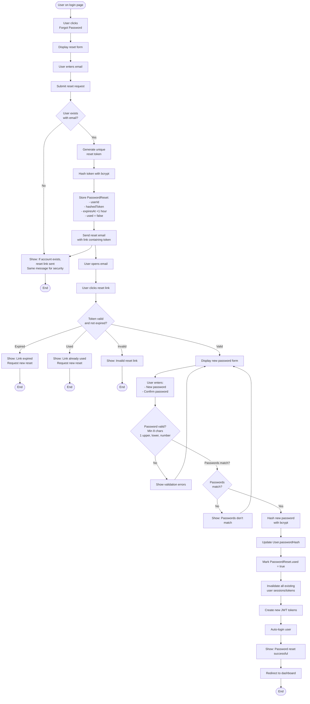

# TeamFlow User Flows

This document contains detailed user flow diagrams for all major features of TeamFlow, using Mermaid flowchart syntax.

## Table of Contents
1. [User Registration & Onboarding](#1-user-registration--onboarding)
2. [User Authentication](#2-user-authentication)
3. [Project & Task Management](#3-project--task-management)
4. [Sprint Planning](#4-sprint-planning)
5. [AI Task Breakdown](#5-ai-task-breakdown)
6. [Team Collaboration](#6-team-collaboration)

---

## 1. User Registration & Onboarding

### 1.1 Email/Password Registration Flow


### 1.2 OAuth Registration Flow


### 1.3 First-Time Onboarding Flow


---

## 2. User Authentication

### 2.1 Login Flow


### 2.2 Password Reset Flow



### 2.3 Token Refresh Flow


---

## 3. Project & Task Management

### 3.1 Create Project Flow


### 3.2 Create Task Flow


### 3.3 Update Task Status (Drag-and-Drop on Kanban)


### 3.4 Add Comment with @Mention

```mermaid
flowchart TD
    Start([User viewing task details]) --> ClickComment[User clicks<br/>Add Comment field]
    ClickComment --> FocusEditor[Focus markdown editor]
    FocusEditor --> TypeComment[User types comment]

    TypeComment --> DetectAt{Types @<br/>character?}
    DetectAt -->|No| ContinueTyping[Continue typing]
    ContinueTyping --> SubmitReady{Ready to<br/>submit?}

    DetectAt -->|Yes| ShowMentionMenu[Show autocomplete menu<br/>with workspace members]
    ShowMentionMenu --> FilterMembers[Filter members<br/>as user types]
    FilterMembers --> SelectMember{User selects<br/>member?}
    SelectMember -->|No Esc| CancelMention[Close menu]
    CancelMention --> ContinueTyping

    SelectMember -->|Yes| InsertMention[Insert @mention:<br/>Display as @name<br/>Store as userId]
    InsertMention --> HighlightMention[Highlight mention<br/>in editor]
    HighlightMention --> ContinueTyping

    SubmitReady -->|Preview| ShowPreview[Show markdown preview]
    ShowPreview --> EditMore{Continue<br/>editing?}
    EditMore -->|Yes| TypeComment
    EditMore -->|No| SubmitReady

    SubmitReady -->|Submit| ValidateComment{Comment valid?<br/>1-5000 chars<br/>Not empty}
    ValidateComment -->|Invalid| ShowError[Show validation error]
    ShowError --> TypeComment

    ValidateComment -->|Valid| ParseMentions[Parse comment:<br/>Extract all @mentions]
    ParseMentions --> CreateComment[Create Comment record:<br/>- taskId<br/>- userId<br/>- content markdown<br/>- createdAt]

    CreateComment --> SaveMentions[Store mentioned userIds<br/>in metadata]
    SaveMentions --> BroadcastComment[Broadcast to WebSocket:<br/>COMMENT_CREATED event]
    BroadcastComment --> CheckMentions{Has<br/>@mentions?}

    CheckMentions -->|No| UpdateTaskUI1[Update task UI<br/>Show new comment]
    CheckMentions -->|Yes| NotifyMentioned[Create notifications<br/>for mentioned users]
    NotifyMentioned --> SendEmails[Send email notifications:<br/>You were mentioned in task]
    SendEmails --> SendWebPush{Web push<br/>enabled?}
    SendWebPush -->|Yes| SendPushNotif[Send push notification]
    SendWebPush -->|No| UpdateTaskUI1
    SendPushNotif --> UpdateTaskUI1

    UpdateTaskUI1 --> LogActivity[Create Activity:<br/>- action: commented<br/>- entityType: comment]
    LogActivity --> IncrementCount[Increment task<br/>comment count]
    IncrementCount --> UpdateOtherUsers[Other users see update<br/>via WebSocket]
    UpdateOtherUsers --> ShowSuccess[Show comment<br/>with rendered markdown]
    ShowSuccess --> ClearEditor[Clear comment editor]
    ClearEditor --> End([End])
```

---

## 4. Sprint Planning

### 4.1 Create Sprint Flow


### 4.2 AI-Assisted Sprint Planning Flow


### 4.3 Add Tasks to Sprint


### 4.4 Complete Sprint


---

## 5. AI Task Breakdown

### 5.1 AI Task Breakdown Flow


---

## 6. Team Collaboration

### 6.1 Invite Team Member Flow


### 6.2 Accept Invitation Flow


### 6.3 Real-Time Update Propagation Flow


---

## Flow Diagram Legend

### Symbols Used
- **Rounded Rectangle**: Start/End points
- **Rectangle**: Process/Action steps
- **Diamond**: Decision points
- **Parallelogram**: Input/Output
- **Arrow**: Flow direction

### Color Coding (when rendered)
- **Green**: Success paths
- **Red**: Error paths
- **Yellow**: Warning/Alternative paths
- **Blue**: User interaction points

### Common Patterns

#### Error Handling
All flows include:
- Validation at multiple levels (client + server)
- Clear error messages
- Recovery options
- Graceful fallbacks

#### Real-Time Updates
Updates propagate via:
- WebSocket broadcasts
- Optimistic UI updates
- Version checking
- Conflict resolution

#### Security
All flows enforce:
- Permission checks
- Authentication requirements
- Rate limiting
- Token validation

---

**Document Version**: 1.0
**Last Updated**: 2025-09-30
**Status**: Ready for Implementation