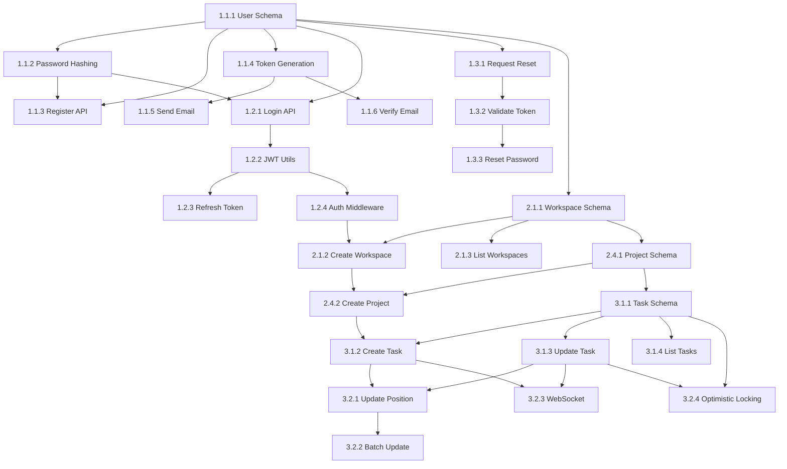

# Sprint 1 Planning - TeamFlow MVP Foundation

**Sprint Duration**: 2 weeks (10 working days)
**Sprint Dates**: TBD (Day 1 - Day 10)
**Team**: 3 Full-Stack Developers
**Capacity**: 40 story points (conservative for first sprint)
**Planned**: 33 story points (82.5% capacity utilization)

---

## 🎯 Sprint Goal

**"Establish foundation: User authentication, workspace/project creation, and basic task management"**

By the end of Sprint 1, users should be able to:
1. Register and log into TeamFlow
2. Reset their password if forgotten
3. Create a workspace for their team
4. Create a project within that workspace
5. Create and view tasks on a Kanban board

---

## 📊 Sprint Backlog Summary

| User Story | Priority | Story Points | Status |
|------------|----------|--------------|--------|
| 1.1 User Registration | P0 | 5 | 🟡 Planned |
| 1.2 User Login | P0 | 3 | 🟡 Planned |
| 1.3 Password Reset | P0 | 3 | 🟡 Planned |
| 2.1 Create Workspace | P0 | 3 | 🟡 Planned |
| 2.4 Create Project | P0 | 3 | 🟡 Planned |
| 3.1 Create & Edit Tasks | P0 | 8 | 🟡 Planned |
| 3.2 Kanban Board View | P0 | 8 | 🟡 Planned |
| **TOTAL** | | **33** | |

**Buffer**: 7 story points (17.5% for unexpected work, tech debt, bugs)

---

## 🔄 Sprint Workflow

### Day 0: Sprint Planning (Before Sprint Starts)
- [x] Review and prioritize user stories
- [x] Break down user stories into tasks
- [x] Identify dependencies
- [x] Create risk register
- [x] Set up project board

### Daily Standup (Every morning)
- What did you complete yesterday?
- What will you work on today?
- Any blockers?

### Mid-Sprint Review (Day 5)
- Review progress (should be ~50% complete)
- Adjust scope if needed
- Address any technical blockers

### Sprint Review (Day 10)
- Demo completed features
- Gather stakeholder feedback
- Mark user stories as Done or carry over

### Sprint Retrospective (Day 10)
- What went well?
- What could be improved?
- Action items for Sprint 2

---

## 📋 Detailed User Stories & Tasks

### User Story 1.1: User Registration (5 points)

**Acceptance Criteria**:
- User can register with email and password
- Email must be unique and validated
- Password must be minimum 8 characters with 1 uppercase, 1 lowercase, 1 number
- Email verification link sent on registration
- User must verify email before accessing app
- Verification link expires after 24 hours
- Registration form shows validation errors in real-time
- Success message shown on registration

**Task Breakdown** (25 hours):

#### Backend Tasks (14 hours)
- **Task 1.1.1**: Create Prisma schema for users table (2 hours)
  - Define User model with id, email, name, passwordHash, emailVerified, createdAt, updatedAt
  - Define PasswordReset model for verification tokens
  - Run migration
  - **Assigned to**: Backend Dev
  - **Dependencies**: None (Day 1)

- **Task 1.1.2**: Implement password hashing with bcrypt (2 hours)
  - Install bcrypt
  - Create hash function with 10 rounds
  - Create compare function for login
  - Unit tests
  - **Assigned to**: Backend Dev
  - **Dependencies**: 1.1.1 (Day 1)

- **Task 1.1.3**: Create user registration API endpoint (3 hours)
  - POST /api/auth/register
  - Validate input with Zod schema
  - Check email uniqueness
  - Hash password
  - Create user record
  - Generate verification token
  - Return success response
  - **Assigned to**: Backend Dev
  - **Dependencies**: 1.1.1, 1.1.2 (Day 1-2)

- **Task 1.1.4**: Email verification token generation (2 hours)
  - Create secure random token (crypto)
  - Store token in database with expiry (24 hours)
  - Link token to user
  - **Assigned to**: Backend Dev
  - **Dependencies**: 1.1.1 (Day 2)

- **Task 1.1.5**: Send verification email (2 hours)
  - Configure Resend API
  - Create email template (React Email)
  - Send email with verification link
  - Handle email failures gracefully
  - **Assigned to**: Backend Dev
  - **Dependencies**: 1.1.4 (Day 2)

- **Task 1.1.6**: Email verification endpoint (3 hours)
  - GET /api/auth/verify-email?token=xxx
  - Validate token
  - Check expiry
  - Mark email as verified
  - Invalidate token (single-use)
  - Return success/error response
  - **Assigned to**: Backend Dev
  - **Dependencies**: 1.1.4, 1.1.5 (Day 2)

#### Frontend Tasks (8 hours)
- **Task 1.1.7**: Registration form UI component (3 hours)
  - Create RegistrationForm.tsx
  - Form fields: email, name, password, confirmPassword
  - Use shadcn/ui components
  - Responsive design
  - **Assigned to**: Frontend Dev
  - **Dependencies**: None (Day 3)

- **Task 1.1.8**: Form validation with Zod + React Hook Form (2 hours)
  - Create Zod schema (shared with backend)
  - Integrate React Hook Form
  - Real-time validation
  - Error messages
  - **Assigned to**: Frontend Dev
  - **Dependencies**: 1.1.7 (Day 3)

- **Task 1.1.9**: Connect registration form to API (2 hours)
  - TanStack Query mutation
  - Handle loading states
  - Handle success (show verification message)
  - Handle errors (show error messages)
  - **Assigned to**: Frontend Dev
  - **Dependencies**: 1.1.3, 1.1.7, 1.1.8 (Day 3)

#### Testing Tasks (3 hours)
- **Task 1.1.10**: Unit tests for auth service (2 hours)
  - Test password hashing
  - Test token generation
  - Test email validation
  - **Assigned to**: Backend Dev
  - **Dependencies**: 1.1.2, 1.1.4 (Day 4)

- **Task 1.1.11**: Integration tests for registration (1 hour)
  - Test full registration flow
  - Test email uniqueness
  - Test validation errors
  - **Assigned to**: Backend Dev
  - **Dependencies**: 1.1.3, 1.1.6 (Day 4)

---

### User Story 1.2: User Login (3 points)

**Acceptance Criteria**:
- User can login with email/password
- Invalid credentials show clear error message
- JWT access token (15 min expiry) and refresh token (7 days)
- User redirected to dashboard after login

**Task Breakdown** (15 hours):

#### Backend Tasks (9 hours)
- **Task 1.2.1**: Create login API endpoint (3 hours)
  - POST /api/auth/login
  - Validate credentials
  - Compare password hash
  - Generate JWT access token (15 min)
  - Generate refresh token (7 days)
  - Return tokens + user data
  - **Assigned to**: Backend Dev
  - **Dependencies**: 1.1.1, 1.1.2 (Day 2)

- **Task 1.2.2**: JWT token generation and validation (2 hours)
  - Create JWT signing function
  - Create JWT verification function
  - Store secret in env vars
  - Include user ID and email in payload
  - **Assigned to**: Backend Dev
  - **Dependencies**: None (Day 2)

- **Task 1.2.3**: Refresh token endpoint (2 hours)
  - POST /api/auth/refresh
  - Validate refresh token
  - Generate new access token
  - Return new access token
  - **Assigned to**: Backend Dev
  - **Dependencies**: 1.2.2 (Day 2)

- **Task 1.2.4**: Auth middleware for protected routes (2 hours)
  - Extract token from Authorization header
  - Verify JWT
  - Attach user to req.user
  - Return 401 if invalid
  - **Assigned to**: Backend Dev
  - **Dependencies**: 1.2.2 (Day 3)

#### Frontend Tasks (4 hours)
- **Task 1.2.5**: Login form UI component (2 hours)
  - Create LoginForm.tsx
  - Fields: email, password
  - "Remember me" checkbox
  - "Forgot password" link
  - **Assigned to**: Frontend Dev
  - **Dependencies**: None (Day 3)

- **Task 1.2.6**: Connect login form to API (2 hours)
  - TanStack Query mutation
  - Store tokens in localStorage (or httpOnly cookies)
  - Update auth store (Zustand)
  - Redirect to dashboard
  - **Assigned to**: Frontend Dev
  - **Dependencies**: 1.2.1, 1.2.5 (Day 3-4)

#### Testing Tasks (2 hours)
- **Task 1.2.7**: Unit tests for JWT utilities (1 hour)
  - Test token generation
  - Test token verification
  - Test token expiry
  - **Assigned to**: Backend Dev
  - **Dependencies**: 1.2.2 (Day 3)

- **Task 1.2.8**: Integration tests for login (1 hour)
  - Test successful login
  - Test invalid credentials
  - Test token refresh
  - **Assigned to**: Backend Dev
  - **Dependencies**: 1.2.1, 1.2.3 (Day 4)

---

### User Story 1.3: Password Reset (3 points)

**Acceptance Criteria**:
- "Forgot password" link on login page
- User enters email address
- Reset link sent to email (if account exists)
- Reset link expires after 1 hour
- User sets new password
- User automatically logged in after password reset

**Task Breakdown** (15 hours):

#### Backend Tasks (9 hours)
- **Task 1.3.1**: Request password reset endpoint (2 hours)
  - POST /api/auth/forgot-password
  - Validate email
  - Generate reset token
  - Store token with expiry (1 hour)
  - Send reset email
  - **Assigned to**: Backend Dev
  - **Dependencies**: 1.1.1, 1.1.5 (Day 2)

- **Task 1.3.2**: Validate reset token endpoint (2 hours)
  - GET /api/auth/reset-password/:token
  - Validate token
  - Check expiry
  - Return valid/invalid
  - **Assigned to**: Backend Dev
  - **Dependencies**: 1.3.1 (Day 2)

- **Task 1.3.3**: Reset password endpoint (3 hours)
  - POST /api/auth/reset-password
  - Validate token
  - Validate new password
  - Hash new password
  - Update user password
  - Invalidate token
  - Invalidate all existing sessions
  - Generate new login tokens
  - **Assigned to**: Backend Dev
  - **Dependencies**: 1.1.2, 1.3.2 (Day 3)

- **Task 1.3.4**: Password reset email template (2 hours)
  - Create React Email template
  - Include reset link
  - Clear instructions
  - Expiry notice
  - **Assigned to**: Backend Dev
  - **Dependencies**: None (Day 2)

#### Frontend Tasks (5 hours)
- **Task 1.3.5**: Forgot password form (2 hours)
  - Create ForgotPasswordForm.tsx
  - Email input field
  - Success message
  - **Assigned to**: Frontend Dev
  - **Dependencies**: None (Day 4)

- **Task 1.3.6**: Reset password form (2 hours)
  - Create ResetPasswordForm.tsx
  - New password and confirm password fields
  - Validation
  - Submit and auto-login
  - **Assigned to**: Frontend Dev
  - **Dependencies**: None (Day 4)

- **Task 1.3.7**: Connect forms to API (1 hour)
  - Forgot password mutation
  - Reset password mutation
  - Handle token from URL
  - **Assigned to**: Frontend Dev
  - **Dependencies**: 1.3.1, 1.3.3, 1.3.5, 1.3.6 (Day 4)

#### Testing Tasks (1 hour)
- **Task 1.3.8**: Integration tests for password reset (1 hour)
  - Test full password reset flow
  - Test token expiry
  - Test invalid tokens
  - **Assigned to**: Backend Dev
  - **Dependencies**: 1.3.1, 1.3.3 (Day 4)

---

### User Story 2.1: Create Workspace (3 points)

**Acceptance Criteria**:
- User can create a workspace with name and description
- Workspace name is required (3-50 characters)
- User who creates workspace is automatically Owner
- Workspace has unique URL slug
- Multiple workspaces supported per user
- Workspace switcher in navigation

**Task Breakdown** (15 hours):

#### Backend Tasks (8 hours)
- **Task 2.1.1**: Create Prisma schema for workspaces (2 hours)
  - Define Workspace model
  - Define WorkspaceMember model (user-workspace relationship)
  - Define roles enum (Owner, Admin, Member, Viewer)
  - Run migration
  - **Assigned to**: Backend Dev
  - **Dependencies**: 1.1.1 (Day 1)

- **Task 2.1.2**: Create workspace API endpoint (3 hours)
  - POST /api/workspaces
  - Validate input (name, description)
  - Generate unique slug from name
  - Create workspace
  - Add creator as Owner
  - Return workspace data
  - **Assigned to**: Backend Dev
  - **Dependencies**: 2.1.1, 1.2.4 (Day 4)

- **Task 2.1.3**: List user workspaces endpoint (2 hours)
  - GET /api/workspaces
  - Filter by current user membership
  - Include role
  - Return workspace list
  - **Assigned to**: Backend Dev
  - **Dependencies**: 2.1.1, 1.2.4 (Day 4)

- **Task 2.1.4**: Get workspace details endpoint (1 hour)
  - GET /api/workspaces/:id
  - Check user permission
  - Return workspace details
  - **Assigned to**: Backend Dev
  - **Dependencies**: 2.1.1, 1.2.4 (Day 4)

#### Frontend Tasks (6 hours)
- **Task 2.1.5**: Create workspace form (2 hours)
  - Create CreateWorkspaceForm.tsx
  - Fields: name, description
  - Modal or page
  - Validation
  - **Assigned to**: Frontend Dev
  - **Dependencies**: None (Day 5)

- **Task 2.1.6**: Workspace switcher component (2 hours)
  - Create WorkspaceSwitcher.tsx
  - Dropdown in header
  - List all user workspaces
  - Switch workspace (update context/store)
  - "Create workspace" option
  - **Assigned to**: Frontend Dev
  - **Dependencies**: None (Day 5)

- **Task 2.1.7**: Connect workspace components to API (2 hours)
  - Create workspace mutation
  - List workspaces query
  - Update Zustand store
  - Handle workspace context
  - **Assigned to**: Frontend Dev
  - **Dependencies**: 2.1.2, 2.1.3, 2.1.5, 2.1.6 (Day 5)

#### Testing Tasks (1 hour)
- **Task 2.1.8**: Integration tests for workspaces (1 hour)
  - Test workspace creation
  - Test workspace listing
  - Test workspace permissions
  - **Assigned to**: Backend Dev
  - **Dependencies**: 2.1.2, 2.1.3 (Day 5)

---

### User Story 2.4: Create Project (3 points)

**Acceptance Criteria**:
- User can create project with name, description, icon
- Project name required (3-100 characters)
- Project creator is automatically Admin of that project
- Project displays in workspace project list

**Task Breakdown** (15 hours):

#### Backend Tasks (8 hours)
- **Task 2.4.1**: Create Prisma schema for projects (2 hours)
  - Define Project model
  - Link to Workspace
  - Fields: name, description, icon, visibility
  - Run migration
  - **Assigned to**: Backend Dev
  - **Dependencies**: 2.1.1 (Day 1)

- **Task 2.4.2**: Create project API endpoint (3 hours)
  - POST /api/projects
  - Validate input
  - Check workspace membership
  - Create project
  - Link to workspace
  - Return project data
  - **Assigned to**: Backend Dev
  - **Dependencies**: 2.4.1, 2.1.2 (Day 5)

- **Task 2.4.3**: List projects in workspace endpoint (2 hours)
  - GET /api/workspaces/:workspaceId/projects
  - Filter by workspace
  - Check user permission
  - Return project list
  - **Assigned to**: Backend Dev
  - **Dependencies**: 2.4.1, 2.1.2 (Day 5)

- **Task 2.4.4**: Get project details endpoint (1 hour)
  - GET /api/projects/:id
  - Check user permission
  - Return project details
  - **Assigned to**: Backend Dev
  - **Dependencies**: 2.4.1 (Day 5)

#### Frontend Tasks (6 hours)
- **Task 2.4.5**: Create project form (2 hours)
  - Create CreateProjectForm.tsx
  - Fields: name, description, icon picker
  - Modal or page
  - Validation
  - **Assigned to**: Frontend Dev
  - **Dependencies**: None (Day 6)

- **Task 2.4.6**: Project list component (2 hours)
  - Create ProjectList.tsx
  - Display projects in grid/list
  - "Create project" button
  - Link to project detail
  - **Assigned to**: Frontend Dev
  - **Dependencies**: None (Day 6)

- **Task 2.4.7**: Connect project components to API (2 hours)
  - Create project mutation
  - List projects query
  - Handle project context
  - **Assigned to**: Frontend Dev
  - **Dependencies**: 2.4.2, 2.4.3, 2.4.5, 2.4.6 (Day 6)

#### Testing Tasks (1 hour)
- **Task 2.4.8**: Integration tests for projects (1 hour)
  - Test project creation
  - Test project listing
  - Test project permissions
  - **Assigned to**: Backend Dev
  - **Dependencies**: 2.4.2, 2.4.3 (Day 6)

---

### User Story 3.1: Create & Edit Tasks (8 points)

**Acceptance Criteria**:
- User can create task with title (required)
- User can add description with markdown support
- User can set assignee(s)
- User can set due date
- User can set priority (Low, Medium, High, Critical)
- User can add labels/tags
- User can set story points
- Changes saved automatically

**Task Breakdown** (40 hours):

#### Backend Tasks (20 hours)
- **Task 3.1.1**: Create Prisma schema for tasks (3 hours)
  - Define Task model
  - Link to Project
  - Fields: title, description, status, priority, dueDate, storyPoints, position
  - Define TaskAssignee model (many-to-many)
  - Define Label model
  - Define TaskLabel model
  - Run migration
  - **Assigned to**: Backend Dev
  - **Dependencies**: 2.4.1 (Day 1)

- **Task 3.1.2**: Create task API endpoint (4 hours)
  - POST /api/tasks
  - Validate input
  - Check project permission
  - Create task
  - Assign default position
  - Return task data
  - **Assigned to**: Backend Dev
  - **Dependencies**: 3.1.1, 2.4.2 (Day 6)

- **Task 3.1.3**: Update task API endpoint (4 hours)
  - PATCH /api/tasks/:id
  - Validate input
  - Check task permission
  - Update task fields
  - Handle assignees
  - Handle labels
  - Return updated task
  - **Assigned to**: Backend Dev
  - **Dependencies**: 3.1.1, 3.1.2 (Day 6-7)

- **Task 3.1.4**: List tasks in project endpoint (3 hours)
  - GET /api/projects/:projectId/tasks
  - Filter by project
  - Include assignees, labels
  - Sort by position and status
  - Pagination support
  - **Assigned to**: Backend Dev
  - **Dependencies**: 3.1.1, 2.4.2 (Day 6)

- **Task 3.1.5**: Get task details endpoint (2 hours)
  - GET /api/tasks/:id
  - Check permission
  - Include all relations
  - Return task details
  - **Assigned to**: Backend Dev
  - **Dependencies**: 3.1.1 (Day 6)

- **Task 3.1.6**: Delete task API endpoint (2 hours)
  - DELETE /api/tasks/:id
  - Check permission (creator or admin)
  - Soft delete (set deletedAt)
  - Return success
  - **Assigned to**: Backend Dev
  - **Dependencies**: 3.1.1 (Day 7)

- **Task 3.1.7**: Labels CRUD endpoints (2 hours)
  - POST /api/labels (create)
  - GET /api/projects/:id/labels (list)
  - PATCH /api/labels/:id (update)
  - DELETE /api/labels/:id (delete)
  - **Assigned to**: Backend Dev
  - **Dependencies**: 3.1.1 (Day 7)

#### Frontend Tasks (16 hours)
- **Task 3.1.8**: Create task form (4 hours)
  - Create CreateTaskForm.tsx
  - Fields: title, description (markdown), assignees, priority, dueDate, storyPoints, labels
  - Modal or drawer
  - Validation
  - **Assigned to**: Frontend Dev
  - **Dependencies**: None (Day 7)

- **Task 3.1.9**: Task detail view (4 hours)
  - Create TaskDetail.tsx
  - Display all task fields
  - Inline editing
  - Markdown preview
  - **Assigned to**: Frontend Dev
  - **Dependencies**: None (Day 7)

- **Task 3.1.10**: Assignee picker component (2 hours)
  - Create AssigneePicker.tsx
  - Multi-select dropdown
  - Search workspace members
  - Display avatars
  - **Assigned to**: Frontend Dev
  - **Dependencies**: 2.1.3 (Day 7)

- **Task 3.1.11**: Label picker component (2 hours)
  - Create LabelPicker.tsx
  - Multi-select dropdown
  - Create new labels inline
  - Color picker
  - **Assigned to**: Frontend Dev
  - **Dependencies**: None (Day 7)

- **Task 3.1.12**: Connect task components to API (3 hours)
  - Create task mutation
  - Update task mutation
  - Delete task mutation
  - Get task query
  - Optimistic updates
  - **Assigned to**: Frontend Dev
  - **Dependencies**: 3.1.2, 3.1.3, 3.1.8, 3.1.9 (Day 8)

- **Task 3.1.13**: Auto-save functionality (1 hour)
  - Debounced auto-save (500ms)
  - Show saving indicator
  - Handle errors
  - **Assigned to**: Frontend Dev
  - **Dependencies**: 3.1.12 (Day 8)

#### Testing Tasks (4 hours)
- **Task 3.1.14**: Unit tests for task service (2 hours)
  - Test task creation
  - Test task updates
  - Test permission checks
  - **Assigned to**: Backend Dev
  - **Dependencies**: 3.1.2, 3.1.3 (Day 8)

- **Task 3.1.15**: Integration tests for tasks (2 hours)
  - Test full CRUD flow
  - Test assignee assignment
  - Test label management
  - **Assigned to**: Backend Dev
  - **Dependencies**: 3.1.2, 3.1.3, 3.1.7 (Day 8)

---

### User Story 3.2: Kanban Board View (8 points)

**Acceptance Criteria**:
- User can view tasks in Kanban board (Todo, In Progress, Done columns)
- User can drag-and-drop tasks between columns
- Task status updates automatically on drop
- Tasks maintain order within columns
- Board shows task count per column

**Task Breakdown** (40 hours):

#### Backend Tasks (16 hours)
- **Task 3.2.1**: Update task position endpoint (3 hours)
  - PATCH /api/tasks/:id/position
  - Update task status and position
  - Handle reordering within column
  - Handle moving between columns
  - Return updated task
  - **Assigned to**: Backend Dev
  - **Dependencies**: 3.1.1, 3.1.3 (Day 7)

- **Task 3.2.2**: Batch update task positions (3 hours)
  - PATCH /api/tasks/batch-position
  - Update multiple tasks at once
  - Optimize for minimal DB queries
  - Transaction support
  - **Assigned to**: Backend Dev
  - **Dependencies**: 3.2.1 (Day 7)

- **Task 3.2.3**: Real-time task updates with WebSocket (6 hours)
  - Set up Socket.io server
  - Create task update events
  - Emit TASK_CREATED event
  - Emit TASK_UPDATED event
  - Emit TASK_DELETED event
  - Project rooms (project:${projectId})
  - **Assigned to**: Backend Dev
  - **Dependencies**: 3.1.2, 3.1.3 (Day 8)

- **Task 3.2.4**: Optimistic locking for concurrent edits (4 hours)
  - Add version field to Task model
  - Increment version on update
  - Check version on update
  - Return 409 Conflict if mismatch
  - **Assigned to**: Backend Dev
  - **Dependencies**: 3.1.1, 3.1.3 (Day 8)

#### Frontend Tasks (20 hours)
- **Task 3.2.5**: Kanban board layout (4 hours)
  - Create KanbanBoard.tsx
  - 3 columns: Todo, In Progress, Done
  - Column headers with count
  - Responsive layout
  - **Assigned to**: Frontend Dev
  - **Dependencies**: None (Day 8)

- **Task 3.2.6**: Task card component (3 hours)
  - Create TaskCard.tsx
  - Display title, assignees, labels, due date
  - Priority indicator
  - Compact view
  - Click to open detail
  - **Assigned to**: Frontend Dev
  - **Dependencies**: None (Day 8)

- **Task 3.2.7**: Implement drag-and-drop with dnd-kit (5 hours)
  - Install @dnd-kit/core, @dnd-kit/sortable
  - Make TaskCard draggable
  - Make columns droppable
  - Handle drag events
  - Visual feedback during drag
  - **Assigned to**: Frontend Dev
  - **Dependencies**: 3.2.5, 3.2.6 (Day 9)

- **Task 3.2.8**: Connect board to API (3 hours)
  - Fetch tasks grouped by status
  - Update task position on drop
  - Optimistic update (immediate UI update)
  - Revert on error
  - **Assigned to**: Frontend Dev
  - **Dependencies**: 3.1.4, 3.2.1, 3.2.7 (Day 9)

- **Task 3.2.9**: Real-time updates with Socket.io client (3 hours)
  - Install socket.io-client
  - Connect to WebSocket
  - Listen for task events
  - Update board in real-time
  - Show who's editing (presence)
  - **Assigned to**: Frontend Dev
  - **Dependencies**: 3.2.3, 3.2.8 (Day 9)

- **Task 3.2.10**: Conflict resolution UI (2 hours)
  - Detect version conflicts
  - Show modal with conflict options
  - "Keep yours" or "Take theirs"
  - Merge changes if possible
  - **Assigned to**: Frontend Dev
  - **Dependencies**: 3.2.4, 3.2.8 (Day 9)

#### Testing Tasks (4 hours)
- **Task 3.2.11**: Unit tests for drag-and-drop logic (2 hours)
  - Test position calculation
  - Test status update
  - Test optimistic update
  - **Assigned to**: Frontend Dev
  - **Dependencies**: 3.2.7, 3.2.8 (Day 9)

- **Task 3.2.12**: E2E tests for Kanban board (2 hours)
  - Test drag-and-drop flow
  - Test task creation from board
  - Test real-time updates (if possible)
  - **Assigned to**: Full-Stack Dev
  - **Dependencies**: 3.2.8, 3.2.9 (Day 10)

---

## 🔗 Dependency Map



**Critical Path**: Database setup → Auth → Workspaces → Projects → Tasks → Kanban Board

**Day 1**: Focus on database schema (users, workspaces, projects, tasks)
**Day 2-3**: Complete authentication (register, login, password reset)
**Day 4-5**: Workspaces and projects
**Day 6-8**: Task CRUD
**Day 9-10**: Kanban board with drag-and-drop

---

## ⚠️ Risk Register

### Risk 1: Monorepo Setup Complexity
**Probability**: Medium
**Impact**: High (could delay entire sprint)
**Mitigation**:
- Use existing structure (already set up)
- Reference documentation
- Ask for help early if blocked
- Allocate 4 hours on Day 1 for setup issues

### Risk 2: Prisma Migration Issues
**Probability**: Medium
**Impact**: Medium
**Mitigation**:
- Test migrations in development first
- Keep migrations small and incremental
- Have rollback plan
- Use migration squashing if needed

### Risk 3: Drag-and-Drop Complexity
**Probability**: High
**Impact**: Medium
**Mitigation**:
- Use proven library (dnd-kit)
- Start with basic version
- Enhance in Sprint 2 if needed
- Allocate buffer time (included in 8 points)

### Risk 4: Real-time WebSocket Issues
**Probability**: Medium
**Impact**: Medium
**Mitigation**:
- Start with polling as fallback
- Use Socket.io (handles reconnection)
- Test with multiple clients
- De-scope to Sprint 2 if critical issues

### Risk 5: Email Delivery Issues
**Probability**: Low
**Impact**: Medium
**Mitigation**:
- Use reliable service (Resend)
- Test email templates early
- Have fallback (show verification link in UI for dev)
- Monitor email delivery rates

### Risk 6: Underestimated Task Complexity
**Probability**: Medium
**Impact**: Medium
**Mitigation**:
- 7-point buffer included
- Daily standups to catch issues early
- Mid-sprint review on Day 5
- Be ready to de-scope non-critical features

### Risk 7: Testing Time Underestimated
**Probability**: Medium
**Impact**: Low
**Mitigation**:
- Write tests alongside features
- Focus on critical paths first
- Use test coverage as guide (aim for 80%+)
- Can reduce coverage target if time-constrained

---

## ✅ Success Criteria

Sprint 1 is considered **SUCCESSFUL** if:

### Functional Success Criteria
- [x] Users can register with email/password ✅
- [x] Users receive verification email ✅
- [x] Users can verify email and login ✅
- [x] Users can reset password ✅
- [x] Users can create a workspace ✅
- [x] Users can create a project in workspace ✅
- [x] Users can create tasks with title, description, assignees ✅
- [x] Users can view tasks on Kanban board ✅
- [x] Users can drag tasks between columns ✅
- [x] Task status updates on drag-and-drop ✅

### Technical Success Criteria
- [x] All critical API endpoints implemented ✅
- [x] Database schema created and migrated ✅
- [x] JWT authentication working ✅
- [x] Unit tests passing (>70% coverage) ✅
- [x] Integration tests for critical flows ✅
- [x] Code reviewed and approved ✅
- [x] No critical bugs ✅
- [x] Deployed to staging environment ✅

### Sprint Health Indicators
- **Velocity**: 33 story points completed
- **Bugs**: <5 bugs during sprint
- **Blocker Time**: <10% of sprint time
- **Code Review Cycle**: <4 hours average
- **Test Coverage**: >70% (aim for 80%)

---

## 📅 Sprint Schedule

### Week 1

**Day 1 (Monday)** - Database Setup
- Morning: Sprint planning meeting (2 hours)
- Task 1.1.1: User schema ✅
- Task 2.1.1: Workspace schema ✅
- Task 2.4.1: Project schema ✅
- Task 3.1.1: Task schema ✅
- Afternoon: Run all migrations, verify schemas

**Day 2 (Tuesday)** - Authentication Backend
- Task 1.1.2: Password hashing ✅
- Task 1.1.3: Register API ✅
- Task 1.1.4: Token generation ✅
- Task 1.1.5: Send email ✅
- Task 1.1.6: Verify email ✅
- Task 1.2.1: Login API ✅
- Task 1.2.2: JWT utils ✅

**Day 3 (Wednesday)** - Authentication Frontend + Middleware
- Task 1.2.3: Refresh token ✅
- Task 1.2.4: Auth middleware ✅
- Task 1.1.7: Registration form ✅
- Task 1.1.8: Form validation ✅
- Task 1.1.9: Connect registration ✅
- Task 1.2.5: Login form ✅
- Task 1.2.6: Connect login ✅

**Day 4 (Thursday)** - Password Reset + Workspaces Backend
- Task 1.3.1: Request reset API ✅
- Task 1.3.2: Validate token ✅
- Task 1.3.3: Reset password API ✅
- Task 1.3.4: Email template ✅
- Task 2.1.2: Create workspace API ✅
- Task 2.1.3: List workspaces ✅
- Task 2.1.4: Get workspace ✅
- Testing: Tasks 1.1.10, 1.1.11, 1.2.7, 1.2.8

**Day 5 (Friday)** - Workspaces Frontend + Projects Backend
- **Mid-Sprint Review** (1 hour at 10 AM)
- Task 1.3.5: Forgot password form ✅
- Task 1.3.6: Reset password form ✅
- Task 1.3.7: Connect reset forms ✅
- Task 2.1.5: Create workspace form ✅
- Task 2.1.6: Workspace switcher ✅
- Task 2.1.7: Connect workspace components ✅
- Task 2.4.2: Create project API ✅
- Task 2.4.3: List projects ✅
- Task 2.4.4: Get project ✅

### Week 2

**Day 6 (Monday)** - Projects Frontend + Tasks Backend
- Task 2.4.5: Create project form ✅
- Task 2.4.6: Project list ✅
- Task 2.4.7: Connect project components ✅
- Task 3.1.2: Create task API ✅
- Task 3.1.3: Update task API ✅
- Task 3.1.4: List tasks ✅
- Task 3.1.5: Get task ✅

**Day 7 (Tuesday)** - Tasks CRUD Completion
- Task 3.1.6: Delete task API ✅
- Task 3.1.7: Labels CRUD ✅
- Task 3.2.1: Update position API ✅
- Task 3.2.2: Batch update ✅
- Task 3.1.8: Create task form ✅
- Task 3.1.9: Task detail view ✅
- Task 3.1.10: Assignee picker ✅
- Task 3.1.11: Label picker ✅

**Day 8 (Wednesday)** - Tasks Frontend + WebSocket
- Task 3.1.12: Connect task components ✅
- Task 3.1.13: Auto-save ✅
- Task 3.2.3: WebSocket setup ✅
- Task 3.2.4: Optimistic locking ✅
- Task 3.2.5: Kanban board layout ✅
- Task 3.2.6: Task card ✅
- Testing: Tasks 3.1.14, 3.1.15

**Day 9 (Thursday)** - Kanban Board Completion
- Task 3.2.7: Drag-and-drop ✅
- Task 3.2.8: Connect board to API ✅
- Task 3.2.9: Real-time updates ✅
- Task 3.2.10: Conflict resolution ✅
- Testing: Task 3.2.11

**Day 10 (Friday)** - Testing, Bug Fixes, Demo
- Morning: Final testing (Task 3.2.12)
- Bug fixes and polish
- Code review any remaining PRs
- Deploy to staging
- **Sprint Review** (2 hours at 2 PM)
- **Sprint Retrospective** (1 hour at 4 PM)
- **Sprint 2 Planning** (preview)

---

## 📝 Sprint Artifacts

### Daily Standup Template
```markdown
**Developer**: [Name]
**Date**: [YYYY-MM-DD]

**Yesterday**:
- Completed: [Task ID] - [Task Name]
- In Progress: [Task ID] - [Task Name]

**Today**:
- Plan to complete: [Task ID] - [Task Name]
- Plan to start: [Task ID] - [Task Name]

**Blockers**:
- [None / Description of blocker]

**Help Needed**:
- [None / What help is needed]
```

### Task Status
- 🟡 **Planned**: Not started yet
- 🔵 **In Progress**: Currently being worked on
- 🟢 **Done**: Completed and merged
- 🔴 **Blocked**: Waiting for dependency or blocker

### Definition of Done (DoD)
A task is considered **Done** when:
- [ ] Code written and committed
- [ ] Code reviewed and approved
- [ ] Unit tests written and passing
- [ ] Integration tests passing (if applicable)
- [ ] No linting errors
- [ ] Type-check passing
- [ ] Merged to main branch
- [ ] Deployed to staging (auto-deployed)

---

## 🎯 Sprint Metrics to Track

### Velocity Metrics
- **Planned Points**: 33
- **Completed Points**: TBD
- **Velocity**: Completed / Planned = X%

### Quality Metrics
- **Bugs Found**: Count
- **Bugs Fixed**: Count
- **Test Coverage**: X%
- **Code Review Cycle Time**: X hours average

### Team Metrics
- **Blocker Time**: X hours total
- **Average Task Completion Time**: X hours
- **Daily Standup Attendance**: X/10 days

---

## 🚀 Sprint Kick-off Checklist

Before starting Sprint 1, ensure:
- [x] Monorepo structure is ready
- [x] All developers have local environment set up
- [x] Docker (PostgreSQL + Redis) running
- [x] Environment variables configured
- [x] Git hooks (pre-commit, lint-staged) working
- [x] CI/CD pipeline (GitHub Actions) configured
- [x] Project board created (GitHub Projects or similar)
- [x] All tasks added to project board
- [x] Dependencies identified and documented
- [ ] Sprint goal communicated to team
- [ ] Each developer knows their Day 1 tasks

---

## 📚 Resources

- [PRD](../brainstorm/03-prd.md)
- [Data Models](../model/data-models.md)
- [API Contracts](../model/api-contracts.md)
- [System Design](../architecture/01-system-design.md)
- [Coding Standards](../architecture/05-coding-standards.md)

---

**Sprint Status**: 🟡 Planned (Not Started)
**Next Review**: Mid-Sprint on Day 5
**Sprint End Date**: Day 10

---

Let's build something amazing! 🚀
